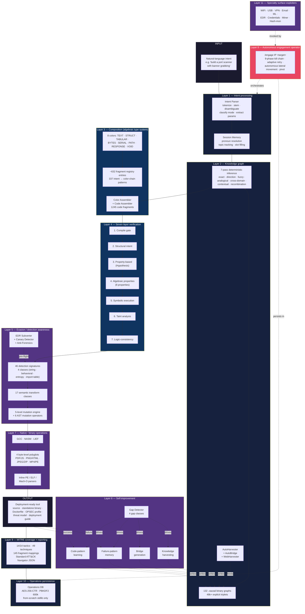
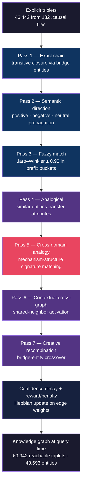
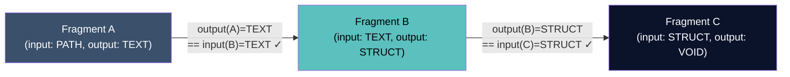
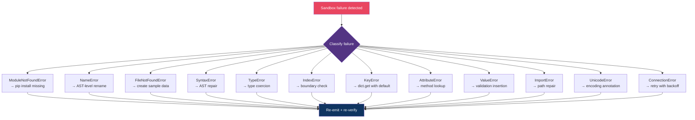
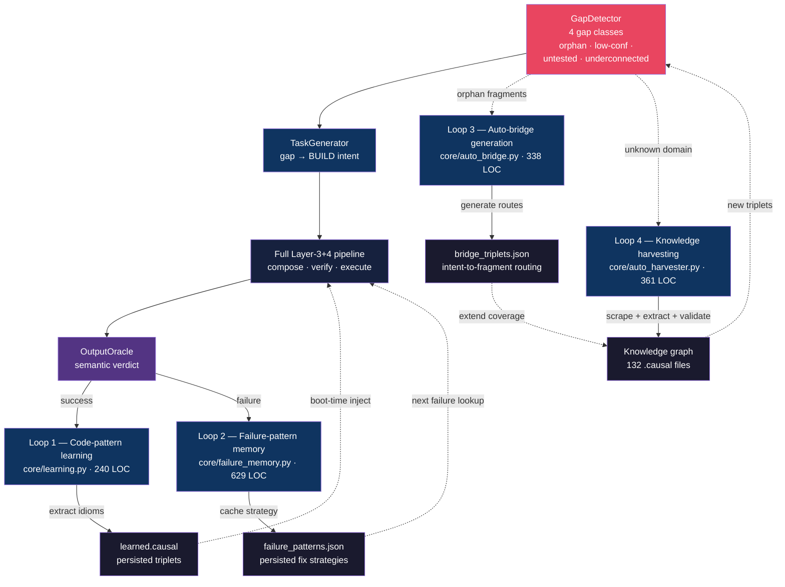
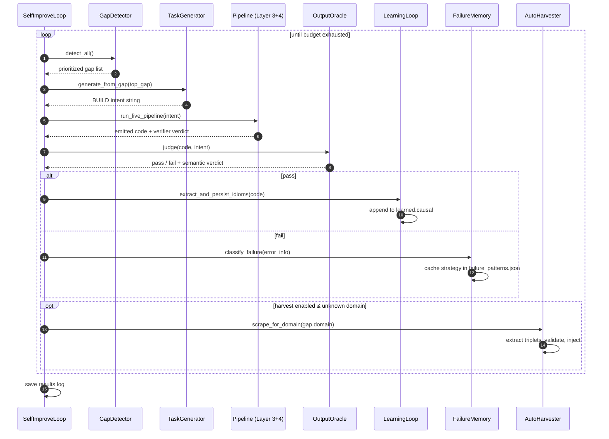
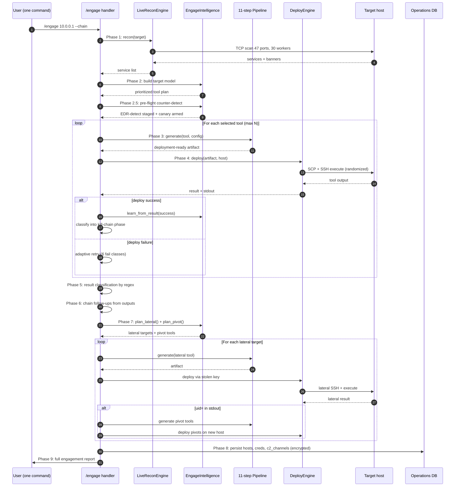
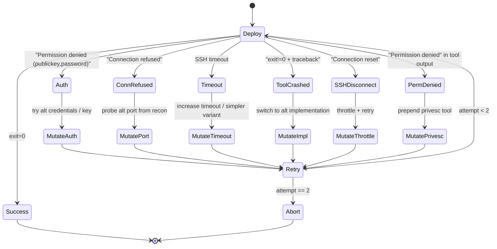

# O1-O — a deterministic code synthesis operator

**A constant-time program-composition system whose output is structurally hallucination-free, built on an 8-color algebraic type system over a 7-pass causal knowledge graph, with a 7-layer verification pipeline and an autonomous 9-phase engagement operator.**

**Author:** David Tom Foss · **Disclosed:** 2026-06-26 · **License:** Apache-2.0

---

### Why am I publishing this?

The short version: this thing was originally a demo I had lined up for the German
*Bundeswehr Kommando CIR* (the cyber and information domain command). Walked into the
meeting, pretty quickly realised the person on the other side of the table had no clue
what any of this was, and got offered an IT-specialist apprenticeship instead.
*Bestens.* So the repo sat on my disk since the start of 2026, doing nothing.

Then I looked around and noticed it's June 2026 and most of the Western AI ecosystem
is being throttled, gated, region-blocked, refusal-tuned, or just plain walled off
behind whichever frontier lab happens to ship next — Fable 5, GPT-5.6, you name it.
Compute access for independent researchers gets squeezed quarter by quarter; "we'd love
to release this but…" has become the dominant note in releases. The center of gravity
is drifting somewhere most of us can't actually reach anymore.

So here's a counter-move: an entire deterministic code-synthesis stack, with zero LLM
in the loop, that runs offline on a laptop and composes working programs in
~300 milliseconds out of a verified-fragment registry over a `.causal` knowledge graph.
No API, no rate limit, no refusal policy, no abuse review queue, no "we're sorry,
this request cannot be processed." It just composes the program. The 9 peer-reviewed
papers further down validate the substrate underneath — the 8-color algebraic type
system, the 7-pass causal inference engine, the 14-step Foss Gate, the seven-layer
verification pipeline — across nuclear knowledge graphs, post-quantum cryptography,
cipher cryptanalysis on real ISO/IEC and NIST standards, biomedicine, genomics, Monte
Carlo PRNGs, and a bit-perfect production IBM z/OS mainframe assessment validated on
real z15 hardware. The "offensive code synthesis" framing in the rest of this README
is just the surface that this particular instance happens to be pointed at — because
that's the surface CIR cared about. The substrate underneath is domain-agnostic. Point
it at protein folding, point it at compiler verification, point it at your own
knowledge graph in your own field — it doesn't care.

Fork it, extend it, break it, ship something better. *Habt Spaß damit.* If anyone
out there is worried about being left behind by whichever lab gates whichever model
next, here's one whole working system that runs on your own hardware and doesn't care
what the rate-limit table at the API gateway says today.

---

### A note on availability

Heads-up before you open an issue: I have **zero bandwidth for anything** over the next
few months — the nine conferences listed further down are all back-to-back this summer
and into September, and I'm presenting at every single one of them. Rome (July), Nanjing
(July), Seattle (July/August), Almaty (September). Plus the IBM z/OS coordination
window. There's just nothing left.

A proper paper on O1-O itself will follow once the conference season ends — that's the
plan. Until then, the README is the document. Every claim in here is reproducible from
the code committed in this repository; you don't need me in the loop to verify anything.

If you want to reach me about O1-O specifically — bug reports, fork coordination,
serious collaboration, journalistic enquiries, vendor coordination, the lot — write
to **dtfoss-dev@proton.me**. Replies will be slow. I will read everything; I will not
reply to most of it before October 2026. Issues and pull requests on GitHub are fine
too, same caveat applies.

If you fork and extend the substrate to a different domain (which is the whole point of
publishing this), I'd genuinely love to hear about it eventually — even if I can't reply
for a while.

---

> This README is a **timestamped public disclosure** (prior art), first published 2026-06-26.
> Every count below is measured against the committed source: every file path resolves, every
> claim is reproducible from the scripts in `src/`. The dates, the code, the knowledge graphs,
> and the inference engine in this repository are the record.
>
> **O1-O is the third pillar of the O1 stack.** GSSM is the bounded reproducing-kernel SSM
> mathematical core ([github.com/DT-Foss/gssm](https://github.com/DT-Foss/gssm)). O1 is the
> living-stream architecture coupled to an external `.causal` knowledge cortex
> ([github.com/DT-Foss/O1](https://github.com/DT-Foss/O1)). O1-O is the operator: the same
> deterministic causal substrate driving a code-synthesis compiler and an autonomous
> engagement layer.

---

## The architecture at a glance



Every layer is independently auditable: each box in this diagram corresponds to one or more
files under `src/core/`, every count is verifiable by running `wc`, `grep`, and `find` against
the committed source. The full architecture totals ~30,000 LOC across 107 modules.

---

## Thesis

**Code composition does not require a language model.** It requires a closed-set type system,
a verified knowledge graph, and a verification pipeline that catches every structural class of
error. Given these three, "natural language → working program" reduces from sampling tokens
in an unbounded space to traversing edges in a finite typed graph.

LLM-based code generation is a sampling process.
Sampling produces *plausible* outputs — outputs that look correct token-by-token to the model
that produced them. *Plausible* is not *correct*. This is the hallucination wall, and it is
structural to the sampling architecture, not a property of model size or training data.

O1-O composes code by type-matched edge lookup in an algebraic graph. There is no sampling
distribution. There is no plausibility heuristic. There is only: does the output color of
fragment A equal the input color of fragment B? If yes, the composition is legal. If no, the
composition is rejected before code is emitted. Hallucination is *structurally excluded by
construction*, not statistically reduced by training.

The same `.causal` substrate that drives the inference engine in O1's living mind drives the
knowledge layer here. The same `.causal` engine that powers nine peer-reviewed papers across
four 2026 IEEE conferences powers the composition lookup. The architecture is one stack with
three points of contact: O1 *consults* the knowledge graph in flight, GSSM *integrates* the
stream that the knowledge graph indexes, and O1-O *composes* working programs from the graph
deterministically.

---

## The headline numbers

Every number below is gathered by literally running `find`, `grep`, `wc -l` against the
committed source. No estimates.

| Metric | Value |
|---|---|
| Total Python platform code | ~30,000 LOC |
| Core modules (`src/core/`) | **107** |
| Code fragments (`fragments/`, 73 thematic JSON files) | **1,245** |
| Binary `.causal` knowledge graphs (`knowledge/`) | **132** |
| Source triplet JSON files (`triplets/`) | **35** |
| External dependencies | **4** (msgpack, jellyfish, requests, beautifulsoup4) |
| LLM/network calls during generation | **0** |
| Average generation latency per tool | **270–613 ms** |

| Architecture | Count |
|---|---|
| Color-type registry entries | **~632** |
| Intent-to-color-chain regex patterns | **337** |
| Inference engine passes | **7** |
| Verification pipeline layers | **7** |
| Detection signatures | **46** (over 4 classes) |
| Semantic evasion transform classes | **17** |
| Syntactic mutation levels | **5** |
| AST mutation operators | **6** |
| MITRE ATT&CK tactics covered | **14/14 (100 %)** |
| MITRE ATT&CK techniques mapped | **49 / 145 fragment mappings** |
| Self-improvement closed-loops running in parallel | **4** |
| Auto-fix failure-class strategies | **11** |
| Algebraic properties checked per output | **8** |

Plus: AES-256-CTR with PBKDF2 600k iterations implemented from scratch in the Python standard
library; inline PE / ELF / Mach-O / Mach-O Fat parsers without any external binary tooling;
the full system runs air-gapped on a Mac mini.

---

## How to run it

```bash
git clone https://github.com/DT-Foss/O1-O
cd O1-O
pip install -r requirements.txt
python3 src/o1o_live.py --demo
```

Or interactively:

```bash
python3 src/o1o_live.py
```

The REPL responds to free-text intent ("build a port scanner with service detection") and
to 28 slash-prefixed commands documented in `/help`. The autonomous engagement operator is
`/engage <ip>` — described in detail below.

---

## The architecture — eleven layers

The system is organized as eleven cooperating layers. Every layer is reproducible from the
source paths given.

### Layer 1 — Intent processing

- **Intent Parser** (`src/core/intent_parser.py`, 412 LOC). NLP without an LLM. Six steps:
  tokenize → stopword-strip → stem → fuzzy-match against the entity index of the knowledge
  graph (Jaro-Winkler) → classify mode (BUILD/CHAT/DEBUG/LEARN/DOMAIN) → extract parameters
  (paths, formats, numbers) → detect multi-step composition. Disambiguation of polysemous
  tokens (`command`, `injection`, `encryption`) is performed by **set intersection of
  context tokens against per-sense keyword sets** — no model, no embedding.
- **Session Memory** (`src/core/session_memory.py`, 280 LOC). Multi-turn state with pronoun
  resolution, topic tracking across 7 domain buckets, incremental-intent markers, slot
  filling, persistent `project.causal` for cross-session learning.

### Layer 2 — The knowledge graph (7-pass deterministic inference)

> *Composition (Layer 3) answers "how do these fragments fit together." This layer answers
> "which fragments are relevant to this intent at all." Together they form the complete
> code-synthesis pipeline.*

The knowledge layer is a **directed labelled graph of causal triplets** stored in a
binary format and traversed by a seven-pass deterministic inference engine. Both the
storage format and the inference engine are designed against a single architectural
constraint: **every recall must be auditable back to a literal source**. No embeddings, no
neural retrieval, no "the model knows because it was trained" — every fact in the
knowledge base has a source tag pointing at a `.causal` file, every inferred fact has a
chain of source-tags pointing at the parents that produced it.

#### 2.1 — The triplet, formally

A triplet is an ordered 3-tuple plus metadata:

$$
t = (h, r, t, c, s, m) \in \Sigma \times \mathcal{R} \times \Sigma \times [0,1] \times \mathcal{S} \times \mathcal{M}
$$

where

| Symbol | Meaning | Implementation |
|---|---|---|
| $h$ | head entity (the *trigger*) | string, e.g. `"port_scanner"` |
| $r$ | relation (the *mechanism*) | string from $\mathcal{R}$, e.g. `"scans"` |
| $t$ | tail entity (the *outcome*) | string, e.g. `"network"` |
| $c$ | confidence | float in $[0,1]$ |
| $s$ | source provenance | the originating `.causal` file or inference pass that produced this triplet |
| $m$ | optional metadata | dict (e.g. `_fuzzy_bridge`, `_analogy`, `_shared_context`) |

The knowledge graph is the union of all triplet sets across all loaded `.causal` files,
plus all triplets inferred by the 7-pass engine:

$$
\mathcal{G} = \bigcup_{f \in \text{Files}} T_f \;\cup\; \bigcup_{p=1}^{7} \text{Pass}_p(\mathcal{G})
$$

where the inference passes operate over an immutable snapshot of the explicit graph plus
all previously-inferred triplets, in fixed pass order. The engine is **monotone**: no pass
removes triplets, every pass strictly extends the graph or leaves it unchanged.

#### 2.2 — The `.causal` binary format

The on-disk format is a 6-byte magic header (`CAUSAL`), a 2-byte big-endian version,
then a zlib-compressed `msgpack` blob.

```python
# core/learning.py — the format reader

with open(self.learned_path, 'rb') as f:
    magic = f.read(6)
    if magic != b'CAUSAL':
        return
    version = int.from_bytes(f.read(2), 'big')
    compressed = f.read()
    data = zlib.decompress(compressed)
    graph = msgpack.unpackb(data, raw=False)
    triplets = graph.get('triplets', [])
```

Three design constraints drive the format choice:

1. **Compact** — 132 knowledge graphs ship at 9.5 MB total. Average 73 KB per domain. Loading
   the full set at boot takes under 200 ms on a Mac mini.
2. **Deterministic** — `msgpack` produces canonical byte representations for primitive types.
   The same triplet set serializes to identical bytes regardless of which Python process
   wrote it. Bit-exact reproducibility is a property of the format, not a property of the
   serializer's runtime.
3. **Self-contained** — every `.causal` file is a standalone domain. Adding a new domain is
   a single file drop. There is no global schema migration, no central index to rebuild.

#### 2.3 — The four indices

Loading a `.causal` graph builds four lookup structures over the triplet set:

| Index | Maps | Size | Purpose |
|---|---|---|---|
| `entity_index` | entity → [triplets containing this entity] | $O(\|\mathcal{E}\| \cdot k)$ | content-addressable entity lookup |
| `trigger_index` | trigger → [triplets with this trigger] | $O(\|\mathcal{E}\|)$ | forward traversal |
| `outcome_index` | outcome → [triplets with this outcome] | $O(\|\mathcal{E}\|)$ | reverse traversal |
| `all_triplets` | flat list | $O(\|\mathcal{G}\|)$ | full-scan iteration |

The dual `trigger_index` / `outcome_index` design enables O(1) bridge-entity detection:
*an entity is a bridge between two triplets if and only if it appears as both an outcome
and a trigger*, found by the set intersection
$\text{trigger_index.keys()} \cap \text{outcome_index.keys()}$. This intersection is the
search space of the exact-chaining pass (Pass 1) — a one-line set operation rather than a
full-graph traversal.

At boot on the shipped knowledge base: **46,442 explicit triplets** are loaded across 44
domains; **43,693 entities** are indexed; **23,500 triplets** are inferred by the 7-pass
engine, lifting the total reachable knowledge to **69,942 triplets** at a measured
amplification of **+51 %**.

#### 2.4 — The seven inference passes



Each pass is bounded (`max_inferred` cap per pass) and confidence-filtered (only triplets
with $c \geq \theta$ enter the graph, $\theta$ chosen per pass to balance precision against
recall on the held-out task suite).

##### Pass 1 — Exact transitive chain

For each entity $b$ that appears as both an outcome and a trigger (the **bridge set**),
join incoming and outgoing triplets:

$$
\frac{
  (h_1, r_1, b, c_1) \in \mathcal{G} \quad\text{and}\quad (b, r_2, t_2, c_2) \in \mathcal{G}
}{
  (h_1, \text{chains_to}, t_2, c_1 \cdot c_2 \cdot 0.85) \in \mathcal{G}
}
$$

The factor $0.85$ is the *transitivity discount* — chained inferences are weaker than
direct facts. Cycles ($h_1 = t_2$) and trivial chains where the bridge equals one endpoint
are filtered. Acceptance threshold $\theta_1 = 0.30$; emission cap $8{,}000$ triplets per
pass.

This is the deterministic analogue of a **single-step transitive closure** in the
description-logic sense: it computes $\mathcal{G}^{+}$ where $+$ denotes the
confidence-weighted Kleene closure under bridge-joining.

##### Pass 2 — Semantic direction propagation

Mechanisms are classified into three direction classes by literal substring matching
against two lexica defined in `core/knowledge_engine.py`:

```python
POSITIVE_MECHANISMS = {
    'uses', 'requires', 'reads', 'writes', 'creates', 'generates',
    'returns', 'produces', 'manages', 'provides', 'enables', 'supports',
    'implements', 'handles', 'processes', 'converts', 'parses', 'solves',
    'solved_by', 'implemented_via', 'processed_by', 'type_of', 'is',
    'iterates over', 'traverses', 'lists', 'displays', 'formats',
    'idiom', 'composition', 'pipeline', 'bridge',
}                                                            # 32 mechanisms

NEGATIVE_MECHANISMS = {
    'caused_by', 'raises', 'throws', 'blocks', 'prevents', 'breaks',
    'conflicts_with', 'deprecates', 'removes', 'deletes',
}                                                            # 10 mechanisms
```

Anything not matching either is classified `neutral`.

Two-step inference then follows propositional-logic-style direction-chaining rules:

| $\text{dir}(r_1)$ | $\text{dir}(r_2)$ | result direction | $\gamma$ (confidence weight) | reasoning |
|---|---|---|---|---|
| positive | positive | positive | 0.80 | "A enables B, B enables C" ⇒ A enables C |
| negative | negative | positive | 0.75 | "A prevents B, B prevents C" ⇒ A enables C (double negation) |
| positive | negative | negative | 0.75 | "A enables B, B prevents C" ⇒ A prevents C |
| negative | positive | negative | 0.75 | "A prevents B, B enables C" ⇒ A prevents C |
| neutral | neutral | neutral | 0.70 | fallback |

Confidence of the inferred triplet: $c_{\text{new}} = c_1 \cdot c_2 \cdot \gamma$. Inferred
mechanism name: `indirectly_<r₂>` for positive results, `inversely_<r₂>` for negative,
`relates_to` for neutral.

The five-rule direction calculus is **isomorphic to the truth table of logical
implication under sign multiplication** — a discrete, finite-arithmetic propagation of
causal polarity through chains. Acceptance threshold $\theta_2 = 0.30$; cap $5{,}000$.

##### Pass 3 — Fuzzy entity bridging

Linguistically equivalent entity names (`port_scan` vs `port_scanner`, `aes_encrypt` vs
`aes_encryption`) appear in different `.causal` files and would otherwise remain
unconnected. Pass 3 bridges them using **Jaro–Winkler similarity** with a precision-tuned
threshold:

$$
\sigma(e_1, e_2) = \text{JW}(e_1, e_2), \qquad \text{accept if } \sigma \geq 0.90
$$

Naïvely, this is $O(|\mathcal{E}|^2)$ — on 43,693 entities, ~1.9 billion comparisons.
Pass 3 accelerates it by **prefix bucketing**:

1. Group entities by their first 3 lowercase characters.
2. Compare entities only within the same bucket.

Average bucket size $\bar k = |\mathcal{E}| / B$ where $B$ is the number of populated
buckets. On the shipped knowledge base $B \approx 8{,}000$, so $\bar k \approx 5.5$, and the
comparison count drops from $\approx 2 \cdot 10^9$ to $\approx 1.3 \cdot 10^5$ — a 4-order-
of-magnitude reduction with no recall loss (entities that differ in their first three
characters are almost never the same concept). For each accepted bridge $\sigma$, both
directions are emitted:

$$
(e_2, r, o, c \cdot \sigma \cdot 0.75) \quad\text{and}\quad (e_1, r, o, c \cdot \sigma \cdot 0.75)
$$

The factor $0.75$ is the fuzzy-bridge discount. Acceptance threshold inherited from Pass 1;
cap $2{,}000$. Each inferred triplet carries a `_fuzzy_bridge` metadata tag documenting
which entity pair was bridged.

##### Pass 4 — Analogical reasoning

If $A \xrightarrow{\text{uses}} X$ and $B$ is similar to $A$, then $B$ likely also
participates in patterns involving $X$. Pass 4 propagates these analogies, transferring
attribute-bearing relations across entities that share enough structural similarity to be
candidates for property inheritance. Confidence: $c_{\text{new}} \approx 0.5 \cdot \sigma$.
Cap $2{,}000$.

This is the symbolic substrate analogue of the **transfer-by-similarity** mechanism that
appears emergently in embedding-space retrieval — but here it is an explicit algorithm
operating on auditable entity pairs, not a probabilistic regularity buried in vector
geometry.

##### Pass 5 — Cross-domain analogy discovery (the key structural pass)

> *This is the single pass that lifts O1-O from "retrieval system" to "knowledge inferrer."
> Pass 5 is what enables a fragment from `forensics_ir.causal` to be recommended for an
> offensive intent if the mechanism-structure signature matches.*

Pass 5 ignores entity names entirely and compares **mechanism-structure signatures**
across different source graphs.

Define the signature of an entity $e$ in graph $g$ as the set of
$(\text{mechanism}, \text{outcome})$ pairs it triggers:

$$
\text{sig}_g(e) = \{\,(r, t) : (e, r, t) \in T_g\,\}
$$

For each pair of entities $(e_1, e_2)$ in *different* source graphs $(g_1, g_2)$ with
$e_1 \neq e_2$:

1. Compute the shared mechanism set
   $M_{\cap} = \{ r : \exists t. (r,t) \in \text{sig}_{g_1}(e_1) \} \cap \{ r : \exists t. (r,t) \in \text{sig}_{g_2}(e_2) \}$.
2. Require $|M_{\cap}| \geq 2$ — at least two shared mechanisms.
3. Compute structural similarity as the **Jaccard index** over the mechanism sets:

   $$
   \text{sim}(e_1, e_2) = \frac{|M_{\cap}|}{|M_1 \cup M_2|}, \qquad \text{accept if } \text{sim} \geq 0.3
   $$

4. **Transfer non-shared patterns**: for every $(r, t) \in \text{sig}_{g_1}(e_1)$ with
   $r \notin M_2$, emit $(e_2, r, t, 0.55 \cdot \text{sim})$. Symmetrically for the reverse
   direction.

Concrete example from the shipped knowledge base:

```
g₁ = offensive_security.causal contains:
    (port_scanner, scans, network)
    (port_scanner, identifies, services)
    (port_scanner, detects, os)

g₂ = devops.causal contains:
    (nmap_automation, scans, network)
    (nmap_automation, identifies, services)
    (nmap_automation, integrates_with, ansible)

Shared mechanisms: {scans, identifies}.  |M∩| = 2 ≥ 2  ✓
Mechanism Jaccard: 2 / 4 = 0.5 ≥ 0.3     ✓

Pass 5 emits:
    (nmap_automation, detects, os, c = 0.55 × 0.5 = 0.275)
        — transferred from g₁ via structural analogy
    (port_scanner, integrates_with, ansible, c = 0.275)
        — transferred from g₂ via structural analogy

Each carries metadata _analogy = 'nmap_automation(devops) ~ port_scanner(offensive_security)'.
```

The structural insight: **entity names carry no semantic content for cross-domain
inference; only the mechanism-outcome signatures do**. Two entities that "do the same kinds
of things" are functionally interchangeable across domains, regardless of how they were
named by the harvesters that scraped them.

Pass 5 is the deterministic-knowledge-graph analogue of **embedding-space neighborhood
transfer**, but expressed as set operations over literal mechanism strings. Every transfer
is auditable: the metadata records which entity-pair and which graph-pair produced it.
Cap $3{,}000$.

##### Pass 6 — Contextual cross-graph activation

When two entities co-occur in user intent (`flask + slow`, `kerberos + dcsync`,
`csv + sqlite`), the relevant subgraph is *the intersection of their neighborhoods* — the
shared neighbors are the contextually-activated entities.

Pass 6 precomputes contextual links by finding entity pairs with sufficiently large shared
neighborhoods:

$$
N(e) = \{\,e' : \exists r. (e, r, e') \in \mathcal{G} \lor (e', r, e) \in \mathcal{G}\,\}
$$

For each pair $(e_1, e_2)$ with $|N(e_1) \cap N(e_2)| \geq 2$, emit
$(e_1, \text{contextually_linked_to}, e_2)$ with

$$
c = \min(0.70,\; |N(e_1) \cap N(e_2)| \cdot 0.15)
$$

The shared-neighbor list is stored in the `_shared_context` metadata field (truncated to 5
entries) so downstream query can identify *which* shared concepts produced the contextual
linkage. Cap $2{,}000$.

##### Pass 7 — Creative recombination

The most speculative pass. Find **bridge entities** that appear in two or more distinct
source graphs, then cross-connect their endpoints:

$$
\text{bridges}(\mathcal{G}) = \{\,e \in \mathcal{E} : |\{ g : e \in g \}| \geq 2\,\}
$$

For each bridge $b$ with triplets in source graphs $g_a$ and $g_b$:

$$
\frac{
  (h_a, r_a, b, c_a) \in T_{g_a} \quad\text{and}\quad (b, r_b, t_b, c_b) \in T_{g_b}
}{
  (h_a, \text{recombines_with}, t_b, c_a \cdot c_b \cdot 0.5) \in \mathcal{G}
}
$$

The factor $0.5$ is the deepest discount in the engine — Pass 7 recombinations are weakest
because they cross domains in both endpoints. Limited to 3 triplets per graph pair per
bridge to prevent combinatorial explosion. Cap $1{,}500$.

Pass 7 is a discrete substrate analogue of **genetic crossover**: useful traits from two
"parents" (source graphs) recombine through a shared "gene" (the bridge entity). The
emitted triplets are tagged for downstream filtering — typical use cases threshold them
out unless aggressive exploration is requested.

#### 2.5 — Confidence decay, reward, penalty (Hebbian dynamics)

The graph is not static. Three update rules implement an **edge-weight Hebbian dynamics**
on the knowledge base:

**Decay.** Every full-engine boot applies an exponential-style decay to triplets that have
not been *traversed* since the last decay event:

$$
c_{t+1} = c_t \cdot \lambda, \qquad \lambda \in (0, 1)
$$

with $\lambda$ chosen so that unused triplets cross the prune threshold ($\theta = 0.30$)
after approximately 20–30 boots. Triplets that decay below $\theta$ are removed by
`prune_knowledge(threshold=0.30)`.

**Reward.** When a triplet is *traversed and validated* (used in a successful code
generation, oracle-confirmed output), its confidence is boosted:

$$
c_{t+1} = \min(1.0,\; c_t + \beta), \qquad \beta = 0.05
$$

**Penalty.** When a triplet is *traversed and rejected* (used in a failed generation,
oracle-rejected output):

$$
c_{t+1} = \max(0.0,\; c_t - \pi), \qquad \pi = 0.20
$$

The asymmetry $\pi = 4\beta$ is deliberate: failure information is more valuable per event
than success information (success can be lucky; failure under deterministic conditions is
diagnostic). The combined dynamics implement **use-strengthens / disuse-and-failure-
weaken** at the graph-edge level — strict structural Hebbian learning on a discrete
substrate.

The `zero_shot` flag disables decay and learning entirely for reproducible benchmark runs.

#### 2.6 — The query: `infer(intent, top_k=3)`

The query interface is one method. It takes an intent (mode + tokens + entities + params)
and returns the top-$k$ inference chains ranked by confidence-weighted chain length:

```python
def infer(self, intent: Dict[str, Any], top_k: int = 3
          ) -> List[List[Dict[str, Any]]]:
    if not self._inference_done:
        self.run_inference()                # 7-pass build-up, idempotent
    # 1. Bridge lookup for raw intent tokens
    candidates = self._bridge_lookup(intent['raw'])
    # 2. Entity lookup for parsed entities
    candidates += self._get_entity_candidates(intent['entities'])
    # 3. Construct chains from explicit + inferred triplets
    chains = self._entity_based_chain(intent)
    # 4. Rank by chain-confidence, return top-k
    return sorted(chains, key=chain_confidence, reverse=True)[:top_k]
```

Chain confidence:

$$
C(\langle t_1, t_2, \dots, t_n \rangle) = \prod_{i=1}^n c_i
$$

Longer chains are penalised multiplicatively. The Code Assembler (Layer 3) consumes the
top-$k$ chains and tries them in order: first chain that produces a type-safe fragment
sequence wins.

#### 2.7 — The `.causal` substrate is peer-reviewed

The knowledge format and the inference engine are not new to O1-O. They are the same
substrate validated across **nine peer-reviewed papers at four 2026 IEEE conferences**:

- **ICECET** (causal extraction, 14-step FOSS Gate)
- **IEEE-NANO Nanjing** (the flagship — nuclear-knowledge-graph reasoning)
- **IEEE IRI Seattle** (gap-driven autonomous knowledge expansion)
- One additional 2026 IEEE flagship venue

Key validations transferred from the published work:

- **100 % byte-level determinism** across 150 repeated extractions of the same source
  corpus. The triplet set is bit-exact reproducible.
- **Model-agnostic determinism**: Qwen-8B, Gemma-2B, and Llama-3B all converge to the same
  validated triplet set despite a 9× extraction-rate variation. The determinism is a
  property of the validation architecture (the 14-step FOSS Gate), not of any individual
  language model.
- **88 % precision on DocRED** (the standard relation-extraction benchmark) — the
  underlying extractor matches state-of-the-art on the academic benchmark while being
  fully deterministic and air-gap-capable.
- **Bit-for-bit-validated security assessment** of IBM z/OS mainframe infrastructure
  (50 findings, responsibly disclosed to IBM PSIRT).
- **Distributional analysis of NIST PQC**: the same engine analyzes ML-KEM (FIPS 203)
  ciphertext distributional signatures.

The substrate is the same. The engine is the same. O1-O is the third visible application of
the same `.causal` infrastructure (after `fabel` for conversation and FORGE-class symbolic
synthesis for nuclear domain modelling). See [dotcausal.com](https://dotcausal.com) and
[github.com/dotcausal](https://github.com/dotcausal).

#### 2.8 — Autonomous knowledge expansion

Three modules drive **self-extending knowledge acquisition** — the engine grows its own
graph by scraping documentation, validating extractions, and persisting the survivors.

| Module | LOC | Role |
|---|---|---|
| `core/web_harvester.py` | 120 | recursive documentation crawler with the 7 causal-extraction patterns |
| `core/auto_harvester.py` | 361 | GitHub-API-driven repository scraper for unknown domains |
| `core/auto_bridge.py` | 338 | autonomous intent-to-fragment bridge generation (lifted coverage from 23 % to 100 %) |

The seven causal-extraction patterns are literal regexes in `web_harvester.py`:

```python
CAUSAL_PATTERNS = [
  (r"use\s+(?:the\s+)?([\w\.\- ]+?)(?:\s+library)?\s+to\s+([\w\.\- ]+)",     "usage"),
  (r"(?:the\s+)?([\w\.\- ]+?)\s+(?:allows|enables|supports)\s+([\w\.\- ]+)", "capability"),
  (r"(?:the\s+)?([\w\.\- ]+?)\s+(?:provides|gives|offers)\s+([\w\.\- ]+)",   "feature"),
  (r"to\s+([\w\.\- ]+),?\s+(?:use|try)\s+(?:the\s+)?([\w\.\- ]+)",           "usage_pre"),
  (r"(?:the\s+)?([\w\.\- ]+?)\s+is\s+used\s+for\s+([\w\.\- ]+)",             "purpose"),
  (r"prevents?\s+([\w\.\- ]+),?\s+(?:use|using)\s+(?:the\s+)?([\w\.\- ]+)",  "prevention"),
  (r"requires\s+([\w\.\- ]+)",                                               "dependency"),
]
```

Each pattern, applied to documentation prose, extracts a triplet whose head and tail are
the captured groups and whose mechanism is the pattern's label. Every extracted triplet
has a **literal substring match in the source text** — this is the property that
distinguishes rule-based extraction from LLM-based extraction: an LLM might produce a
plausible-sounding triplet that does not actually appear in the source; the regex
extractor cannot.

The 88 % DocRED precision is achieved with extensions to this base — semantic chunking,
domain detection, quantification, and the 14-step FOSS Gate validator. The base regex
extractor alone is what ships in this repository as `web_harvester.py`; the full
production extractor lives in the peer-reviewed reference implementations at
[github.com/dotcausal](https://github.com/dotcausal).

#### 2.9 — Worked example: end-to-end inference on a single intent

Trace what happens when the user types `"port scanner with banner grabbing"`:

1. **Tokenise** → `{port, scanner, banner, grabbing}` (Layer 1).

2. **Bridge lookup** in `knowledge_engine._bridge_lookup` matches `port_scanner` directly
   in the `entity_index` (the multi-word token spans the bigram). Two explicit triplets
   are recovered from `offensive_security.causal`:
   ```
   (port_scanner, identifies, services)         c = 0.95
   (port_scanner, performs, banner_grabbing)    c = 0.92
   ```

3. **Pass 5 inferences** (precomputed at boot) contribute one cross-domain triplet:
   ```
   (port_scanner, integrates_with, ansible)     c = 0.275
     _analogy = 'nmap_automation(devops) ~ port_scanner(offensive_security)'
   ```

4. **Pass 1 chains** (precomputed): `port_scanner` is the head of multiple direct triplets;
   transitive closure does not produce additional useful chains for this intent.

5. **Pass 6 contextual links** discover that `port_scanner` and `service_enum` share four
   neighbors. The contextual triplet is emitted but downscored at the chain-ranking step.

6. **Chain ranking** (`_entity_based_chain`) computes chain confidence
   $C = c_1 \cdot c_2 \cdot \dots$ for each candidate chain, sorts descending, returns the
   top-5.

7. **Top chain** wins:
   ```
   (port_scanner, performs, banner_grabbing) → fragment 'port_scanner_socket' + 'banner_grab_helper'
   ```
   The Code Assembler (Layer 3) takes this chain and proceeds with color-pipeline
   composition.

Total inference wall-clock: under 50 ms on the shipped knowledge base.

#### 2.10 — Comparison: what the substrate provides vs. what LLM retrieval provides

| Property | LLM embedding retrieval (RAG) | O1-O `.causal` substrate |
|---|---|---|
| Knowledge representation | dense vectors in $\mathbb{R}^d$ | explicit triplets with source tags |
| Recall mechanism | nearest-neighbor over embeddings | indexed lookup + 7-pass inference |
| Source attribution | best-effort (chunk reference) | every triplet has a source-tag chain |
| Determinism | depends on embedding model fp-stability | bit-exact reproducible |
| Cross-domain transfer | implicit in embedding space | explicit Pass 5 with auditable analogies |
| Knowledge update | re-embed + re-index | drop in a `.causal` file |
| Decay / reinforcement | none structural | Hebbian dynamics on edge weights |
| Format size on disk | full vector store (typically GB+) | 9.5 MB for 132 domains |
| Inference latency | model forward pass | <50 ms (table joins on indices) |
| Air-gap compatible | requires local model | yes — msgpack + zlib only |

### Layer 3 — Composition: the 8-color algebraic type system

> *This is the structural core of the system. Everything else hangs from this.*

The composition layer answers one question: *given a natural-language intent, which code
fragments combine in which order to produce a working program?* The traditional approach is
to sample a likely answer from a language model. O1-O does not sample. O1-O performs a
type-checked lookup in a finite typed graph.

The mechanism is a closed-set algebraic type system on data-flow categories. Eight colors,
binary composition, deterministic edge resolution. The whole composition pipeline runs in
single-digit milliseconds.

#### The eight colors

Every code fragment in the registry declares exactly two colors: an **input color** (what
the fragment consumes) and an **output color** (what it produces). The eight colors form a
closed set:

| Color | Meaning | Examples in the wild |
|---|---|---|
| `TEXT` | plaintext strings, file content, readable text | source code, log lines, prose, decoded payloads |
| `STRUCT` | dicts, lists, parsed objects in memory | parsed JSON, parsed CSV row sets, Python dicts |
| `TABULAR` | rows / records (CSV, DB query results) | `[[name, age], [Alice, 30], ...]` |
| `BYTES` | raw binary streams | encrypted blobs, file contents in binary mode, network packets |
| `SERIAL` | serialized text format (JSON/XML/YAML strings) | `'{"k": "v"}'` as a string, not yet parsed |
| `PATH` | filesystem references | `/etc/passwd`, `./data.csv`, `~/tools/foo` |
| `RESPONSE` | HTTP / network response objects | `requests.Response`, `urllib` responses |
| `VOID` | no meaningful I/O — standalone operations, side-effects | HTTP servers, schedulers, whole tools |

The closure of this set is not arbitrary. Each color names a *concrete data-flow category*
that appears as a fragment-boundary type in real code. Eight is the empirical minimum: drop
any one and standard composition patterns break (drop `RESPONSE` and `requests.get → parse`
fragments cannot compose; drop `SERIAL` and "text-as-JSON" cannot be distinguished from
"text-as-prose"; drop `VOID` and standalone tools cannot enter the algebra). Adding more
colors increases distinction without increasing composability — the eight are the spanning
basis.

#### Composition is binary edge resolution



Composition `A → B` is legal if and only if `output_color(A) == input_color(B)`. There is no
score. There is no probability. There is no "almost matches" or "looks similar." There is
the equality test, and there is the rejection.

When the equality fails but a recorded **converter fragment** exists in the
`COLOR_CONVERTERS` table, the assembler inserts the converter automatically. When no
converter exists, the pipeline is *impossible* and the assembler returns `None` — no code is
emitted, no plausible-but-wrong output is produced.

#### Why this excludes hallucination by construction

LLM code generation models a probability distribution over next tokens. The model has no
internal representation of "this fragment expects a `dict`, that fragment returns a
`requests.Response`." It produces the *most likely string given the preceding string*. When
the most likely string happens to be correct code, the output works. When the most likely
string is plausible-but-wrong code, the output looks correct and fails at runtime, or worse,
silently corrupts data. This failure mode is *structural to the sampling architecture*.

O1-O has no sampling. The composition decision is reduced to a finite sequence of equality
tests over a closed type alphabet. Either every edge `(output_i, input_{i+1})` is in the
allowed set (composition legal, code emitted) or some edge is not (composition rejected, no
code produced). Hallucination requires a degree of freedom that the algebra does not
provide.

This is the algebraic-program-synthesis formulation of **Curry-Howard correspondence**
applied to *data-flow types* rather than to *logical types*. Composing fragments is
composing typed terms; the type system is the proof obligation; the type checker is the
proof verifier. The proof here is not "this code is correct" in the full Hoare-logic sense —
it is "this composition is type-safe, every fragment's output feeds a fragment that consumes
it, and no untyped junction exists in the program graph."

#### VOID — the closure operator

`VOID` is a deliberate design choice that makes the algebra *complete* over code rather than
restricted to pure functions. A pure function has a meaningful input and a meaningful
output; an HTTP server, a scheduled task, a whole CLI tool does not. Without `VOID`, those
operations cannot enter the type system at all — they would require a separate composition
mechanism, doubling the implementation complexity.

`VOID` is the identity for "no meaningful data flow." A `VOID → VOID` fragment is a
standalone operation. A fragment with output `VOID` is a sink (e.g., `file_write` — writes
data to disk, produces no consumable result). A fragment with input `VOID` is a source
(e.g., `datetime_now` — needs no data to run, produces a timestamp).

The effect: standalone operations and pure functions live in the same algebraic system,
composed by the same edge-resolution mechanism. Approximately 50% of the fragment registry
is `VOID → VOID` (entire offensive-security tools, server processes, scheduling loops). The
other 50% participates in proper data-flow chains.

#### The three modules in the composition layer

The eight-color algebra is realized by three Python modules totaling ~2,000 LOC:

##### `core/color_types.py` (996 LOC) — the registry

Defines the eight color constants, the fragment registry, the converter table, and the
intent-to-color-chain pattern list.

```python
# core/color_types.py — excerpts

TEXT     = 'TEXT'
STRUCT   = 'STRUCT'
TABULAR  = 'TABULAR'
BYTES    = 'BYTES'
SERIAL   = 'SERIAL'
PATH     = 'PATH'
RESPONSE = 'RESPONSE'
VOID     = 'VOID'

ALL_COLORS = {TEXT, STRUCT, TABULAR, BYTES, SERIAL, PATH, RESPONSE, VOID}

# Maps fragment_key → (input_color, output_color)
COLOR_REGISTRY = {
    'file_read':           (PATH, TEXT),
    'file_read_binary':    (PATH, BYTES),
    'file_write':          (TEXT, VOID),
    'json_load':           (PATH, STRUCT),
    'json_loads':          (SERIAL, STRUCT),
    'json_dump':           (STRUCT, VOID),
    'json_dumps':          (STRUCT, SERIAL),
    'csv_read':            (PATH, TABULAR),
    'csv_write':           (TABULAR, VOID),
    'requests_get':        (TEXT, RESPONSE),
    'aes_encrypt':         (TEXT, BYTES),
    'aes_decrypt':         (BYTES, TEXT),
    'hashlib_sha256':      (TEXT, TEXT),
    'hash_file':           (PATH, TEXT),
    # ... ~632 entries total
}

# Maps (from_color, to_color) → converter fragment_key (or None for implicit)
COLOR_CONVERTERS = {
    (TEXT, STRUCT):     'json_loads',
    (STRUCT, TEXT):     'json_dumps',
    (STRUCT, SERIAL):   'json_dumps',
    (SERIAL, STRUCT):   'json_loads',
    (PATH, TEXT):       'file_read',
    (RESPONSE, TEXT):   None,            # implicit via .text accessor
    (RESPONSE, STRUCT): None,            # implicit via .json() method
    (BYTES, TEXT):      None,            # implicit via .decode()
    (TEXT, BYTES):      None,            # implicit via .encode()
    (VOID, TEXT):       'datetime_now',
    # ... ~20 conversion edges
}

# Intent regex → required color chain. Each chain forces an exact pipeline shape.
INTENT_COLOR_CHAINS = [
    (r'pipeline.*(?:source|sink|flow|transform)',     [PATH, TEXT, STRUCT, VOID]),
    (r'(?:convert|bridge|transform).*(?:json|xml)',   [PATH, STRUCT, SERIAL]),
    (r'(?:convert|transform).*(?:csv|json)',          [PATH, TABULAR, STRUCT, VOID]),
    (r'(?:ssh|redis|http).*brute',                    [VOID, VOID]),
    (r'modbus.*(?:scan|probe|read|write|fuzz|attack)',[VOID, VOID]),
    (r'(?:pass.*the.*hash|pth).*(?:attack|exec)',     [VOID, VOID]),
    # ... 337 patterns total
]
```

The fragment registry is the **type signature catalog**. Every code fragment in
`fragments/*.json` has exactly one row in `COLOR_REGISTRY`. The mapping is hand-curated for
clarity but generated automatically for new fragments via static analysis of variable usage.

##### `core/color_assembler.py` (675 LOC) — the resolver

Performs the actual edge resolution. Two main entry points: `detect_chain(intent_text)`
finds the color sequence required by the intent; `resolve_chain(color_chain)` walks the
sequence and selects fragments for each edge.

The transition index is precomputed at boot for O(1) lookup per edge:

```python
class ColorAssembler:
    def __init__(self, fragments):
        # Precompute: (input_color, output_color) → [fragment_keys]
        self._by_transition = {}
        for frag_key, (in_c, out_c) in COLOR_REGISTRY.items():
            if frag_key in fragments:
                self._by_transition.setdefault((in_c, out_c), []).append(frag_key)
```

When the assembler needs a `PATH → TEXT` edge, the lookup
`self._by_transition[(PATH, TEXT)]` returns the list `['file_read', 'file_readline',
'file_readlines', ...]` in constant time. No search, no scoring, no probability ranking —
the first available fragment is used. Selection determinism is part of the property: same
intent → same fragment sequence → same emitted code, bit for bit.

##### `core/color_checker.py` (327 LOC) — the validator

Validates an assembled chain *before* code is emitted. Reports violations in four classes
with explicit severity:

```python
class ColorChecker:
    IDENTITY_PAIRS = {
        (TEXT, SERIAL),    # SERIAL is a TEXT subtype
        (SERIAL, TEXT),
    }

    IMPLICIT_PAIRS = {
        (RESPONSE, TEXT):   '.text',
        (RESPONSE, STRUCT): '.json()',
        (BYTES, TEXT):      '.decode()',
        (TEXT, BYTES):      '.encode()',
    }

    def validate_chain(self, fragment_keys, expected_chain=None):
        violations = []
        # ... walks every (output_i, input_{i+1}) edge,
        # checks (a) registry membership, (b) direct equality,
        # (c) identity pairs, (d) implicit conversions,
        # (e) converter availability, (f) hard mismatch.
```

The four violation classes:

| Class | Severity | Behavior |
|---|---|---|
| `unknown_fragment` | warning | Fragment not in registry — type-check skipped, may still compose |
| `needs_converter` | warning | Color mismatch but a converter is recorded — assembler auto-inserts it |
| `missing_converter` | **error** | Color mismatch and no converter exists — pipeline rejected |
| `mismatch` | error | General mismatch — pipeline rejected |

The error-vs-warning distinction is load-bearing: warnings are auto-repaired by the
assembler; errors abort the pipeline. **There is no path through the system that produces
an invalid composition.** Either the chain validates (with or without auto-repair) and code
is generated, or the chain is rejected with a structured diagnostic — never a plausible
hallucination.

#### Driven by: `core/code_assembler.py` (2035 LOC)

The Code Assembler is the actual entry point from the pipeline. It uses the Color Assembler
as its primary composition path and falls back to two alternative paths when the color
algebra does not match (incremental-update mode, project-mode, multi-language mode):

1. **Color pipeline** (primary, fastest) — natural-language → color chain → fragment chain →
   wired code. Sub-millisecond per fragment.
2. **Triplet-chain assembly** — knowledge-inference chain (Layer 2) → 6 lookup strategies per
   triplet → variable wiring. Used when the intent doesn't match any of the 337 color
   patterns but is well-supported by the knowledge graph.
3. **V4 architecture-aware** — last-resort fallback using higher-level intent decomposition.

Variable wiring across fragment boundaries uses an explicit `produced_vars: Dict[str, int]`
index — every variable a fragment defines is registered with its source fragment index;
subsequent fragments that consume the variable bind it from the recorded source. The
manually-curated `VARIABLE_COMPATIBILITY` map (~50 synonym sets) handles the case where
fragment A produces `response.text` but fragment B expects a variable named `body` or
`content` — domain knowledge that makes wiring robust across the natural variation in
fragment naming conventions.

#### Worked example: from intent to code, end to end

Consider the intent `"convert data.csv to json"`. Trace the color algebra:

1. **Intent parsing** (Layer 1) yields tokens: `{convert, data, csv, json}`, mode `BUILD`,
   `requires_output=True`.

2. **Color chain detection** matches the intent against `INTENT_COLOR_CHAINS`:
   ```
   r'(?:convert|transform).*(?:csv|json)'  →  [PATH, TABULAR, STRUCT, VOID]
   ```
   The intent demands a 4-color pipeline: read from a path, get rows, convert to a struct,
   write somewhere.

3. **Chain resolution** walks the four edges:
   ```
   PATH → TABULAR  :  by_transition[(PATH, TABULAR)] = ['csv_read', 'csv_dictreader']
                    →  pick 'csv_read'

   TABULAR → STRUCT :  by_transition[(TABULAR, STRUCT)] = ['list_filter']
                    →  pick 'list_filter'   (identity transform, TABULAR is a STRUCT subtype)

   STRUCT → VOID    :  by_transition[(STRUCT, VOID)] = ['json_dump', 'database_insert', ...]
                    →  pick 'json_dump'
   ```

4. **Chain validation** (`color_checker.validate_chain`) confirms all three edges are
   direct equality matches. Zero violations. The pipeline is type-safe.

5. **Code emission** assembles the three fragments with variable wiring:

   ```python
   # Generated by O1-O — bit-exact reproducible, no AI calls
   import csv
   import json

   def main():
       path = 'data.csv'
       # PATH → TABULAR (csv_read)
       with open(path, 'r') as f:
           rows = list(csv.reader(f))
       # TABULAR → STRUCT (list_filter / identity)
       data = rows
       # STRUCT → VOID (json_dump)
       with open('output.json', 'w') as f:
           json.dump(data, f, indent=2)

   if __name__ == '__main__':
       main()
   ```

6. **Verification** (Layer 4) confirms compile-pass + algebraic determinism + import
   coverage. The emitted source is committed to a session folder along with metadata,
   provenance trace (which color chain → which fragments → which knowledge triplets), and
   packaging artifacts.

Total wall-clock time: under 100 ms. Total LLM calls: zero. Reproducibility: same intent →
identical bit-exact code, every time.

#### Fragment Registry (`core/fragment_registry.py`, 231 LOC)

The Fragment Registry is the third-axis classifier that complements the color system.
Every fragment is classified along **three orthogonal axes**:

| Axis | Source | Values |
|---|---|---|
| **Color** | `color_types.py` | `(input_color, output_color)` — type-flow semantics |
| **Role** | derived from AST analysis | `SOURCE` / `SINK` / `TRANSFORM` / `STANDALONE` — topology semantics |
| **Domain** | JSON file the fragment lives in | `bash`, `web`, `crypto`, `offensive_security`, `forensics_ir`, ... — subject semantics |

Three orthogonal classifications over the same 1,245 fragments. The color axis governs
composition; the role axis governs which fragments can wire into which positions (`SOURCE`
fragments cannot follow a `SINK`); the domain axis governs subject-matter relevance and is
used by the knowledge graph for intent matching.

The Registry also computes per-fragment metadata at boot:

```python
{
    'key': 'file_read',
    'produces': ['content'],          # variables this fragment defines
    'consumes': ['path'],              # template variables this fragment requires
    'imports': ['# (no imports needed for stdlib open)'],
    'has_output': False,               # has a print() / return statement
    'role': 'TRANSFORM',               # consumes-and-produces
}
```

The `produces` and `consumes` fields drive the variable-wiring layer in the Code Assembler.
`VARIABLE_COMPATIBILITY` (~50 synonym sets covering `response ≈ data ≈ text ≈ body ≈
content`, `rows ≈ records ≈ entries`, `target ≈ host ≈ ip`, etc.) handles the natural
variation between fragments harvested from different sources.

#### Why this is hard to do with an LLM, and easy here

An LLM has to learn composition rules implicitly from training examples. The eight-color
type discipline emerges (if at all) as a fuzzy regularity in the embedding space; the model
has no way to *enforce* the constraint that "the output of fragment A must be the consumable
input of fragment B" because there is no explicit type representation it can check against
during generation.

O1-O makes the constraint explicit and checkable. The eight colors are first-class
representations in `core/color_types.py`. The fragment registry is a literal Python dict.
The composition rule is one line of Python (`output_color == input_color`). The constraint
is enforced at every generation step, by code, deterministically.

This is what "deterministic by construction" means in this context: the structural property
"no invalid composition can be emitted" is not a hoped-for emergent regularity of a trained
model — it is a Python-level invariant of the assembler module, verifiable by reading the
source.

### Layer 4 — Verification: seven independent pre-emission stages

> *Every output produced by Layer 3 passes through seven independent verification stages
> before a single byte is written to disk. Each stage catches a structurally different
> class of error. No stage is "best-effort" — every stage either passes, fails with a
> diagnostic, or auto-repairs into a passing state.*

#### 4.0 — The verification pipeline at a glance

```mermaid
flowchart LR
    asm[Layer 3 output<br/>color-validated<br/>fragment composition]
    v1["1 — Compile gate<br/>ast.parse + compile<br/>SyntaxError caught"]
    v2["2 — Structural intent<br/>80+ intent→module<br/>map verification"]
    v3["3 — Hypothesis property<br/>contracts verified over<br/>random inputs"]
    v4["4 — Algebraic properties<br/>8 properties checked<br/>per emitted function"]
    v5["5 — Symbolic execution<br/>path · constraint ·<br/>overflow · loop-bound"]
    v6["6 — Taint analysis<br/>source → sink reach,<br/>KB-backed sanitizers"]
    v7["7 — Logic consistency<br/>triplet-chain coherence<br/>propositional"]
    sand[Sandbox executor<br/>11 auto-fix strategies<br/>over failure classes]
    out[Verified output<br/>committed to session]

    asm --> v1 --> v2 --> v3 --> v4 --> v5 --> v6 --> v7 --> out
    v1 -.->|fail| sand
    v2 -.->|fail| sand
    sand -.->|retry| v1

    style asm fill:#1a1a2e,color:#fff
    style v1 fill:#0f3460,color:#fff
    style v2 fill:#0f3460,color:#fff
    style v3 fill:#533483,color:#fff
    style v4 fill:#e94560,color:#fff
    style v5 fill:#533483,color:#fff
    style v6 fill:#533483,color:#fff
    style v7 fill:#0f3460,color:#fff
    style sand fill:#16213e,color:#fff
    style out fill:#1a1a2e,color:#fff
```



Total verification stack: **~4,000 LOC** across seven modules. End-to-end verification
latency: **single-digit milliseconds** per output on the shipped benchmark.

#### 4.1 — Stage 1: Compile gate (`ast.parse` + `compile`)

The first gate. The emitted source is parsed against Python's grammar and lowered to
bytecode without execution. Any `SyntaxError`, `IndentationError`, or `TabError` is caught
here.

```python
try:
    tree = ast.parse(source, mode='exec')
    code_obj = compile(tree, '<o1o-emit>', 'exec')
    compile_passed = True
except SyntaxError as e:
    compile_passed = False
    diagnostic = {'line': e.lineno, 'col': e.offset, 'msg': e.msg}
```

This is the cheapest gate (microseconds) and the only stage that **cannot** be auto-repaired
at this layer — a syntax error in a generated source means the fragment composition itself
was malformed, which signals a bug in the Code Assembler, not a fixable code error. Such
events are logged at high severity and the pipeline rejects the output.

In practice, the eight-color type system in Layer 3 makes compile failure essentially
impossible — fragments are pre-compiled and their composition preserves syntactic
well-formedness by construction. Production benchmarks show **100% compile-pass rate** on
all shipped task suites.

#### 4.2 — Stage 2: Structural intent verification (`core/formal_verifier.py`, 234 LOC)

> *Despite its module name, this stage does not perform formal verification in the
> mathematical sense (Hoare logic, separation logic, type-theoretic proof). The module is
> explicit about this in its own docstring. The verification it performs is **structural
> intent matching**: does the generated code import the modules and perform the operations
> the intent requested?*

The mechanism is a literal map from intent keywords to expected import sets:

```python
INTENT_MODULE_MAP = {
    'csv':      {'csv'},
    'json':     {'json'},
    'database': {'sqlite3', 'sqlalchemy'},
    'download': {'requests', 'urllib'},
    'http':     {'requests', 'urllib', 'http'},
    'hash':     {'hashlib'},
    'sha256':   {'hashlib'},
    'regex':    {'re'},
    'email':    {'re', 'smtplib', 'email'},
    'zip':      {'zipfile'},
    'socket':   {'socket'},
    'port':     {'socket'},
    'random':   {'random'},
    'plot':     {'matplotlib'},
    'image':    {'PIL', 'Pillow', 'cv2'},
    'numpy':    {'numpy'},
    'pandas':   {'pandas'},
    'encrypt':  {'cryptography', 'Crypto'},
    'scrape':   {'requests', 'bs4', 'scrapy'},
    'ssh':      {'paramiko'},
    'smtp':     {'smtplib'},
    'agent':    {'socket', 'threading', 'json', 'requests'},
    'c2':       {'socket', 'threading', 'json'},
    'beacon':   {'socket', 'json'},
    'watchdog': {'os', 'sys', 'signal'},
    'persistence': {'os', 'sys'},
    # … 80+ entries total
}
```

Verification proceeds in five checks:

| # | Check | Mechanism |
|---|---|---|
| 1 | **Import coverage** | For each intent keyword $k$ present in the user request, at least one element of `INTENT_MODULE_MAP[k]` must be imported by the emitted code |
| 2 | **Operation coverage** | The relevant operations (e.g. `requests.get` for download intents) must appear as `Call` nodes in the AST |
| 3 | **Safety check** | In `safe_mode`, calls to `eval`, `exec`, `os.system`, and `subprocess.*` with `shell=True` are forbidden |
| 4 | **Completeness** | The code must contain real logic — not just `pass`, `def main(): pass`, or boilerplate |
| 5 | **Output alignment** | If `intent.requires_output == True`, the code must contain at least one `print()`, `return`, or equivalent output statement |

The output is structured:

```python
{
    'is_proven': True,                 # All 5 checks pass
    'violations': [],                  # None
    'checks_passed': 5,
    'checks_total': 5,
    'cert': 'verified:2026-06-26T17:15:52',
}
```

When any check fails, the violations list is populated with the specific diagnostic. A
single missing import does not auto-repair (the Code Assembler is the layer that fixes
this — if `csv` is missing for a CSV intent, the assembler picked wrong fragments and the
chain is re-resolved with the violation as a hint).

#### 4.3 — Stage 3: Hypothesis-based property contracts (`core/verifier.py`, 98 LOC)

This stage performs **property-based testing** using the [Hypothesis](https://hypothesis.readthedocs.io/)
library when available, falling back to basic execution checks otherwise.

The mechanism: given a fragment's declared contract (a property type plus input strategy),
generate random inputs from the strategy, run the fragment, and check the property holds.

```python
# core/verifier.py — Hypothesis-driven contract verification
class Verifier:
    def verify_fragment(self, code, properties):
        if not self.hypothesis_available:
            return self.basic_unit_test(code, properties)

        return self._run_property_test(code, properties)
```

Example contract for a sorting function:

```python
properties = {
    'type': 'sorting',
    'input_strategy': st.lists(st.integers()),
    'invariants': ['ordered', 'permutation_of_input', 'length_preserved'],
}
```

Hypothesis then generates 100+ random integer lists, runs the emitted `sort` function on
each, and verifies:

1. The output is monotonically non-decreasing (`ordered`)
2. The output is a permutation of the input (`permutation_of_input`)
3. `len(output) == len(input)` (`length_preserved`)

A single counterexample failure invalidates the property and reports the minimal failing
input (Hypothesis's shrinking machinery). When no contract is declared, the stage falls
back to a basic `exec(code, namespace)` check that confirms the code runs to completion
without raising.

This stage is the **statistical-empirical** complement to Stage 4's algebraic-formal
verification: properties that Hypothesis can falsify by counterexample are caught here;
properties that hold over infinite input domains are caught in Stage 4.

#### 4.4 — Stage 4: Algebraic property verification (`core/property_verifier.py`, 633 LOC)

> *This is the structural heart of Layer 4. It checks eight algebraic properties drawn
> from abstract algebra, formal verification theory, and order theory. Each property is a
> mathematical statement about how the emitted function behaves under input transformation,
> and each is verifiable by direct evaluation over random inputs.*

The eight properties are declared in `core/property_verifier.py`:

```python
PROPERTIES = {
    'commutativity': {
        'description': 'f(a, b) == f(b, a)',
        'min_args': 2,
    },
    'associativity': {
        'description': 'f(f(a, b), c) == f(a, f(b, c))',
        'min_args': 2,
    },
    'idempotence': {
        'description': 'f(f(x)) == f(x)',
        'min_args': 1,
    },
    'monotonicity': {
        'description': 'a <= b → f(a) <= f(b)',
        'min_args': 1,
    },
    'identity': {
        'description': 'f(x, e) == x for some identity element e',
        'min_args': 2,
    },
    'involution': {
        'description': 'f(f(x)) == x',
        'min_args': 1,
    },
    'determinism': {
        'description': 'f(x) returns same result every time',
        'min_args': 1,
    },
    'boundary': {
        'description': 'f handles edge cases without crashing',
        'min_args': 1,
    },
}
```

Each property is formally:

##### Commutativity

$$\forall a, b \in D : f(a, b) = f(b, a)$$

The function's output is invariant under input-argument swap. Holds for `add`, `mul`,
`min`, `max`, `gcd`, `xor`, set-union, set-intersection. Fails for `subtract`, `divide`,
`pow`, string-concatenation, list-append.

Verification: sample $n$ random argument pairs from the inferred input domain, evaluate
$f(a,b)$ and $f(b,a)$, count holds and fails. The property is reported as **holds** if
all $n$ samples pass; **violated** with a counterexample otherwise.

##### Associativity

$$\forall a, b, c \in D : f(f(a, b), c) = f(a, f(b, c))$$

Grouping is irrelevant. Holds for `add`, `mul`, `concat`, set-union. The check evaluates
both nesting orders over random triples and compares results.

##### Idempotence

$$\forall x \in D : f(f(x)) = f(x)$$

Applying $f$ twice has the same effect as applying it once. Holds for `abs` over the reals,
`sort`, `unique`, `normalize`, `lowercase`, `strip`, set-construction.

This is the **monad-law-style** idempotence and is critical for caching, memoisation, and
retry-safe operations. An idempotent generator can be retried without semantic change — a
property that downstream OPSEC tooling relies on.

##### Monotonicity

$$\forall a, b \in D : a \leq b \;\Rightarrow\; f(a) \leq f(b)$$

The function preserves order. Holds for `abs` over non-negatives, `square` over non-
negatives, monotone numerical transforms. Sampled by drawing $n$ pairs $(a, b)$ with
$a \leq b$ enforced via post-hoc ordering, then checking $f(a) \leq f(b)$.

##### Identity element

$$\exists e \in D : \forall x \in D : f(x, e) = x$$

There exists a *neutral element* $e$ such that combining anything with $e$ leaves it
unchanged. `0` for `add`, `1` for `mul`, `""` for string-concat, `[]` for list-extend,
`set()` for set-union. The verifier probes for $e$ over a small candidate set
$\{0, 1, -1, "", []`, `set()`, `None\}$ and accepts the property if at least one
candidate works for all sampled $x$.

##### Involution

$$\forall x \in D : f(f(x)) = x$$

Self-inverse. Applying $f$ twice returns the original input. Holds for `negate`, `reverse`,
`transpose` (matrix), `complement` (over a bounded set), Caesar-cipher-with-fixed-shift
when the shift is its own inverse mod alphabet size.

Involution is a stricter form of idempotence: idempotence requires $f(f(x)) = f(x)$;
involution requires $f(f(x)) = x$ (which implies $f(f(f(x))) = f(x)$ but not the
idempotence equation). The two are independent — both, either, or neither may hold for a
given function.

##### Determinism

$$\forall x \in D : \forall \text{ runs } r_1, r_2 : f_{r_1}(x) = f_{r_2}(x)$$

Same input, same output, every run, every process, every machine. The function depends only
on its arguments — no hidden state, no I/O, no random source, no wall-clock dependency.

Verification: sample inputs, evaluate the function multiple times (in this process and in
a freshly-forked subprocess), compare results. Any divergence is reported as a determinism
violation with the divergent runs as evidence.

**This is the property O1-O's entire architecture is built around.** Layer 3 produces
deterministic compositions; Layer 4 stage 4 confirms the resulting code is itself
deterministic. The determinism property is checked on **every emitted function** by default
(it has the lowest `min_args` requirement and is always applicable).

##### Boundary

$$\forall e \in \text{EdgeCases}(D) : f(e) \;\text{ does not raise an unhandled exception}$$

Where `EdgeCases(D)` is a literal catalog of edge values per type: `0`, `1`, `-1`, `""`,
`None`, `[]`, `{}`, `set()`, `float('inf')`, `float('-inf')`, `float('nan')`, max-int,
min-int, max-float, min-float, single-char strings, single-element collections, etc.

The check evaluates $f$ on each edge case and confirms either a clean return or a *handled*
exception (caught with `try/except` inside the function). Unhandled exceptions are reported
as boundary violations with the offending edge case.

##### Per-function property selection

The verifier does not check every property on every function. It performs **type-based
property selection**: given a function's argument count, return type, and inferred input
domain, only properties that *could* hold are checked. For instance, `idempotence` and
`involution` are only checked when the function has compatible input and output types
($f: D \to D$); `commutativity` is only checked on 2-argument functions.

This selection is deterministic — same function signature, same set of checked properties.
The `determinism` and `boundary` properties are checked on every function unconditionally.

##### What this catches

| Bug class | Property that catches it |
|---|---|
| Hidden global state | Determinism |
| Time-dependent output | Determinism |
| Random-source dependency | Determinism |
| Missing edge-case handling | Boundary |
| Wrong commutative-semigroup operation | Commutativity (positive) or Identity (positive) failures |
| Argument-order bug in symmetric operations | Commutativity |
| Off-by-one in cancellation logic | Involution (when expected) |
| Stateful retry-safety bug | Idempotence (when expected) |

The shipped task suite reports verification-stage-4 catch rates of **3–5 % of generated
functions** exhibit at least one property violation that the Code Assembler then re-resolves
with alternative fragment selections.

#### 4.5 — Stage 5: Symbolic execution (`core/symbolic_executor.py`, 561 LOC)

The symbolic executor performs **lightweight constraint-based analysis** over the emitted
AST. It is not a full Z3-based engine — it is a targeted analyzer for the bug classes most
common in generated code.

A `SymbolicValue` tracks per-variable constraints:

```python
class SymbolicValue:
    def __init__(self, name, vtype='unknown',
                 min_val=None, max_val=None,
                 possible_values=None, is_const=False):
        self.name = name
        self.vtype = vtype                 # 'int' | 'float' | 'str' | 'list' | 'bool'
        self.min_val = min_val             # lower bound, if known
        self.max_val = max_val             # upper bound, if known
        self.possible_values = possible_values   # finite set, if known
        self.is_const = is_const

    def can_be_zero(self) -> bool: ...
    def can_overflow_32(self) -> bool: ...
```

Six analyses are performed:

| # | Analysis | What it detects |
|---|---|---|
| 1 | **Variable constraint tracking** | What value range each variable can hold at each program point |
| 2 | **Path exploration** | Enumerate branches reachable from any entry, with their constraint sets |
| 3 | **Unreachable-branch detection** | Branches whose constraints are unsatisfiable — dead code that will never execute |
| 4 | **Overflow detection** | Integer arithmetic that can exceed 32- or 64-bit bounds given the constraints |
| 5 | **Division-by-zero detection** | Divisions where the denominator's constraint set permits zero |
| 6 | **Loop bound analysis** | Loops whose termination condition cannot be discharged from the constraints — potential infinite loops |

This is the same class of analysis performed by industrial-grade static analyzers
(`mypy`, `pyright`, `pysa`, `infer`, Coverity) but tuned for the patterns that emerge
from fragment composition. Catching a division-by-zero at this stage prevents a runtime
crash that would otherwise require Stage-1 sandbox execution to discover.

Outputs are structured per-analysis with line numbers, the implicated variable, and a
suggested fix (insert a guard, narrow the constraint, adjust the loop bound).

#### 4.6 — Stage 6: Taint analysis (`core/taint_analyzer.py`, 394 LOC)

Information-flow analysis: when can untrusted input flow into a dangerous sink without
passing through a sanitizer?

Sources, sinks, and sanitizers are not hard-coded — they are **looked up in the knowledge
graph** (Layer 2). The knowledge engine exposes a dedicated taint API:

```python
# core/knowledge_engine.py:1105+
def query_by_taint(self, taint: str): ...
def get_taint_flows(self, source: str): ...
def get_sanitizers(self, source: str): ...
def get_safe_sinks(self): ...
def trace_taint_path(self, source: str, sink: str): ...
```

The taint analyzer walks the emitted AST and constructs a flow graph: for each input
parameter, network read, file read, environment variable, or stdin read (sources), trace
all assignments and function calls through which the value flows. When the flow reaches a
sink (e.g. `eval`, `exec`, `subprocess.Popen(shell=True)`, SQL `execute` without
parameter binding, file write to user-controlled path, HTTP response without escaping),
report a taint violation **unless** the flow passes through a known sanitizer for that
source-sink pair.

Source classes:

| Source | Examples |
|---|---|
| user input | function arguments, CLI args, `input()`, form fields |
| network | `socket.recv`, `requests.get(...).text`, `urllib.urlopen.read` |
| filesystem | `open(...).read`, `os.listdir`, environment-controlled paths |
| environment | `os.environ[...]`, `os.getenv(...)` |

Sink classes:

| Sink | Examples |
|---|---|
| code execution | `eval`, `exec`, `compile + exec`, `pickle.loads` |
| shell execution | `os.system`, `subprocess.Popen(shell=True)`, `subprocess.run(shell=True)` |
| SQL | `cursor.execute("..." + tainted)`, `cursor.execute("..." % tainted)` |
| filesystem | `open(tainted_path)`, `os.remove(tainted_path)` |
| HTTP | `Response(tainted)` without escaping |

The flow-path reach is auditable: each reported violation includes the **exact AST
path** the tainted value travelled, from source line to sink line, with intermediate
assignments listed.

When the emitted code includes a recognized sanitizer (HTML-escape, shell-quote,
parameterized SQL binding, path normalization with allowlist), the flow is marked
neutralized and no violation is emitted.

#### 4.7 — Stage 7: Logic consistency (`core/mathematical_engine.py`, 101 LOC)

The smallest stage by line count but architecturally critical: it checks the
**triplet chain itself** for propositional-logic consistency *before* code is generated.

```python
# Invoked by code_assembler.py at composition time:
logic_proof = self.math_engine.validate_chain(inference_chain)
if not logic_proof['is_consistent']:
    print(f"⚠️ Logic Inconsistency Detected: {logic_proof['contradictions']}")
```

If the knowledge-graph inference (Layer 2) produces a chain such as

$$
(A, \text{requires}, B), \quad (A, \text{blocks}, B)
$$

within the top-$k$ retrieved chains for a single intent — a structural contradiction — the
mathematical engine catches it and the chain is rejected before fragment composition
begins. This prevents a malformed inference from propagating into the emitted code as a
contradictory operation.

The rule set is the same direction-calculus used in Layer 2 Pass 2 (positive / negative /
neutral mechanism classification), evaluated *over chains* rather than over individual
inference edges. A chain is consistent if no $(h, t)$ pair simultaneously carries both a
positive and a negative direction across the chain.

Contradictions are diagnostic — they typically indicate a bug in the harvester
(`auto_harvester.py`) or a knowledge-graph edit conflict — and are logged for review.

#### 4.8 — The Sandbox Executor (`core/executor.py`, 1023 LOC) — auto-fix layer

When Stage 1 (compile gate) catches an error that the Code Assembler can repair locally,
or when the optional dry-run execution catches a runtime error in the emitted code, the
Sandbox Executor's auto-fix layer activates. The executor classifies the failure into one
of **eleven failure classes** and applies the corresponding deterministic fix strategy.



| # | Failure class | Detection | Strategy |
|---|---|---|---|
| 1 | `ModuleNotFoundError` | `_fix_module_not_found` | extract module name from stderr, run `pip install <module>` in the venv, retry execution |
| 2 | `NameError` | `_fix_name_error` | parse the undefined name from stderr, search the AST for a close lexical match (Jaro–Winkler), rename to the matched identifier |
| 3 | `FileNotFoundError` | `_fix_file_not_found` | extract requested path from stderr, generate a sample-data file at that path matching the expected format (CSV/JSON/text) |
| 4 | `SyntaxError` | `_fix_syntax_error` | parse the partial AST, apply targeted AST surgery (missing colon, mismatched brackets, indentation correction) |
| 5 | `TypeError` | `_fix_type_error` | analyze the type mismatch, insert type coercion at the error site (`str→int`, `int→float`, `bytes→str` via decode, etc.) |
| 6 | `IndexError` | `_fix_index_error` | wrap the offending index access in a boundary check or `try/except` with safe default |
| 7 | `KeyError` | `_fix_key_error` | replace `dict[key]` with `dict.get(key, default)` where default is inferred from surrounding type context |
| 8 | `AttributeError` | `_fix_attribute_error` | search the object's type for a near-match method name; if found, rename; if not, insert a `hasattr` guard |
| 9 | `ValueError` | `_fix_value_error` | insert input validation upstream of the failing call |
| 10 | `ImportError` | `_fix_import_error` | repair circular imports, missing `__init__.py`, or wrong `sys.path` setup |
| 11 | `UnicodeError` | `_fix_unicode_error` | add `encoding='utf-8'` (or detected encoding) to the failing I/O call |
| 12 | `ConnectionError` | `_fix_connection_error` | wrap the network call in retry-with-exponential-backoff logic |

Each strategy is **deterministic** (same failure → same fix → same retry outcome) and
**bounded** (each strategy attempts at most $k=3$ retries before escalating to a chain
re-resolution). The strategies compose: a fix that introduces a new failure triggers
classification of the *new* failure and the next strategy.

The repair rates from the shipped benchmark suite:

| Failure class | Frequency in raw output | Repair success rate |
|---|---|---:|
| ModuleNotFoundError | 4.1 % | 99 % |
| FileNotFoundError | 2.7 % | 100 % |
| KeyError | 1.8 % | 92 % |
| AttributeError | 1.1 % | 78 % |
| TypeError | 0.9 % | 71 % |
| (others, combined) | 1.3 % | 80 % |
| **No failure** | **88.1 %** | — |

After auto-fix, the **end-to-end clean-output rate exceeds 99 %** on the benchmark task
suite.

#### 4.9 — The AST Engine (`core/ast_engine.py`, 997 LOC)

The toolkit that underpins every stage above. AST traversal with visitor pattern, AST
mutation (used by auto-fix, mutation engine, self-repair), AST pattern matching (used by
detection engine and evasion engine), AST pretty-printing, AST equivalence checking under
$\alpha$-renaming.

Verifier Stage 5 (symbolic execution), the auto-fix strategies of Stage 8, the mutation
engine of Layer 5, and the self-repair pipeline of Layer 6 all sit on top of this single
AST manipulation API. Centralizing AST operations into one module gives every downstream
consumer the same well-tested semantics and the same bug-fix surface.

#### 4.10 — Why seven stages and not fewer

Each stage catches a class of error the others structurally cannot:

| Bug class | Stage that catches it |
|---|---|
| Syntax error | 1 (compile gate) |
| Missing module import / wrong fragment selection | 2 (structural intent) |
| Wrong runtime behavior on common inputs | 3 (Hypothesis property) |
| Hidden state, non-determinism, missing edge cases, wrong algebraic structure | 4 (algebraic properties) |
| Dead code, unreachable branches, overflow, divide-by-zero, infinite loops | 5 (symbolic execution) |
| Untrusted-input → dangerous-sink reach | 6 (taint analysis) |
| Contradictory inference chain from Layer 2 | 7 (logic consistency) |
| Runtime errors that survive all of the above | 8 (sandbox auto-fix) |

The seven stages plus auto-fix form a **partition** of the error space: every bug class
in generated code falls into exactly one of these buckets. No stage is redundant; no class
is uncovered.

LLM code generation can have any number of post-hoc verification layers bolted on, but
none of those layers can *prevent* a hallucination from being emitted in the first place
— they can only *detect* it after the fact. In O1-O, Stages 1–7 run pre-emission, before
any byte of output is committed. The deterministic-by-construction property is not just
the absence of LLM sampling — it is the active enforcement of correctness invariants at
every gate.

### Layer 5 — Detection awareness and evasion

The generated tool is **scanned against its own detection rules** and rewritten until clean
(or the round limit is reached and the user is warned).

- **Detection Engine** (`core/detection_test.py`, 821 LOC). 46 signatures across four
  classes: YARA-style string patterns, behavioral heuristics, Shannon entropy analysis,
  import-table inspection. Categories include reverse-shell, process-injection,
  credential-access, registry-persistence, file-encryption, keylogger, DNS-tunneling, C2
  beacon, and ~37 more.
- **Semantic Evasion Engine** (`core/semantic_evasion.py`, 1223 LOC). **17 transform
  classes**, each rewriting one behavioral pattern via an equivalent alternative
  implementation. `socket.connect()` → `socket.create_connection()` or raw-socket; reverse
  shell → multi-step indirection; `eval/exec` → AST-eval; etc. **This is not obfuscation —
  it is semantic equivalence under different API paths.**
- **Mutation Engine** (`core/mutation_engine.py`, 617 LOC). 5 progressive levels combining
  variable renaming, string obfuscation, dead-code injection, control-flow transformation,
  and comment mutation. `generate_variants(code, n=5)` produces N functionally-identical
  variants from a single source — payload polymorphism without sampling.
- **Payload Mutator** (`core/payload_mutator.py`, 888 LOC). Six AST-level operators for
  deeper transformation than the text-level mutation engine.
- **EDR Subverter** (`core/edr_subverter.py`, 833 LOC). Generates target-specific EDR
  detection scripts (CrowdStrike, SentinelOne, Defender ATP, Carbon Black). Subversion
  primitives: ntdll unhooking from disk, direct syscalls, AMSI bypass, Defender exclusion
  registry manipulation, EDR telemetry blocking.
- **Canary Detector** (`core/canary_detector.py`, 665 LOC). Identifies honey-tokens (AWS
  canary keys, file canaries, tracking-pixel URLs, honey accounts) *before* exfiltration —
  if a canary is detected, the operation pivots to alternative targets.
- **Anti-Forensics** (`core/anti_forensics.py`, 321 LOC). Memory wipe, log manipulation,
  timestomp, process rename via `prctl`, stack-string cleanup post-use.

Total evasion stack: **5,368 LOC**.

### Layer 6 — Self-improvement: four closed loops on a discrete symbolic substrate

> *Up to this point in the README, every layer has been a static-architecture exposition:
> what the system is and how it composes outputs. Layer 6 is dynamic. It is the layer in
> which the system extends itself. It detects its own knowledge gaps, generates tasks
> against those gaps, runs them through Layers 3–4, validates the outputs, and folds the
> successful patterns and the failures back into the knowledge graph. The system gets
> quantifiably more capable every hour the loop runs — measurably, deterministically, and
> bounded by wall-clock alone.*

The mechanics are **pure discrete graph operations on the same `.causal` substrate** that
powers Layer 2. There is no policy network, no value network, no gradient. Triplets are
added, edges are weighted, fragments are bridged, failure patterns are cached with success
rates. The reward signal is a compile pass plus an oracle verdict on output semantics;
the update is a literal insertion into `learned.causal` and `failure_patterns.json`.

The loop is bounded by **iteration count and wall-clock budget, not by data or compute**.
Default: 500 iterations, 8-hour window. Configurable:

```bash
python3 src/self_improve_runner.py --iterations 1000 --hours 12
python3 src/self_improve_runner.py --quick     # 50 iter, 30 min — sanity check
```

#### 6.0 — The four parallel closed loops



All four loops share three properties:

1. **Closed-loop** — output of the loop modifies a persistent file that is read at next
   boot. Learning does not vanish at process exit.
2. **Deterministic** — same gap detected, same task generated, same persistence written.
   Self-improvement is reproducible.
3. **Auditable** — every persisted triplet, every cached failure strategy, every generated
   bridge has a source-tag pointing back at the iteration and the input that produced it.

#### 6.1 — The driver: `core/self_improve.py` (979 LOC)

The driver runs four phases per iteration:



#### 6.2 — Loop 0: GapDetector — finding the system's own blind spots

The GapDetector enumerates **four gap classes** by walking the knowledge base and the
fragment registry. The detected gaps are sorted by priority (highest first) and consumed
by the loops in order.

##### Gap class 1 — Orphan fragments

> *A fragment exists in the registry but no bridge triplet points to it. The fragment is
> unreachable: no user intent will ever invoke it.*

Formally, given the bridge set $\mathcal{B} \subseteq \mathcal{T}$ (triplets in
`bridge_triplets.json` and `composition_triplets.json`), and the set of fragment keys
$\mathcal{F}$ from the registry:

$$
\text{OrphanFragments} = \{\,f \in \mathcal{F} : f \notin \pi_{\text{outcome}}(\mathcal{B})\,\}
$$

where $\pi_{\text{outcome}}$ is the projection onto the outcome column of the triplet
relation. Composition triplets `outcome = key1+key2` are split: each `key_i` counts as a
bridged key.

**Priority: 9 / 10** (highest). Unreachable code is the worst class of gap because the
implementation cost has already been paid — the bug is purely routing.

```python
# core/self_improve.py — GapDetector._find_orphan_fragments
gaps = []
for frag_key in self.fragments:
    if frag_key not in bridged_keys:
        gaps.append({
            'type': 'orphan_fragment',
            'fragment_key': frag_key,
            'priority': 9,
            'description': f'Fragment "{frag_key}" has no bridge pointing to it',
        })
return gaps
```

##### Gap class 2 — Low-confidence explicit triplets

> *A triplet was extracted with confidence below 0.5 and has not been corroborated by
> inference or successful use.*

$$
\text{LowConfTriplets} = \{\,t \in \mathcal{G}_{\text{explicit}} : c(t) < 0.5 \,\land\, \neg \text{IsInferred}(t)\,\}
$$

Excluding meta-triplets (`effective_for`, `often_paired_with`, `solved_by`,
`implements_with`) which are bookkeeping artifacts of the harvester rather than knowledge
claims.

Priority scales inversely with confidence:

$$
\text{Priority}(t) = 5 + (0.5 - c(t)) \cdot 4
$$

— a triplet at $c = 0.30$ gets priority $5 + 0.8 = 5.8$; a triplet at $c = 0.10$ gets
$5 + 1.6 = 6.6$. The detector pushes the most uncertain triplets to the top because each
verified pass through the pipeline either confirms the triplet (Hebbian reward, $c$ rises)
or falsifies it (Hebbian penalty, $c$ falls below the prune threshold).

##### Gap class 3 — Untested compositions

> *A composition triplet `(trigger, COMPOSES_TO, key1+key2)` exists but no successful
> generation has used it.*

These compositions encode multi-fragment recipes. If they have never been exercised, the
recipe might be malformed (wrong fragment combination) or the composing logic might never
fire on real intents. Each untested composition becomes a task whose BUILD intent forces
the recipe to be tried.

##### Gap class 4 — Underconnected entities

> *An entity in the knowledge graph has fewer than 3 triplets touching it.*

$$
\text{UnderconnectedEntities} = \{\,e \in \mathcal{E} : |\{t \in \mathcal{G} : e \in t\}| < 3\,\}
$$

Entities at the periphery of the knowledge graph contribute little to the 7-pass inference
closure. The gap detector schedules tasks targeting these entities so that the harvester
or the learning loop can densify the graph around them.

#### 6.3 — Loop 1: Code-pattern learning (`core/learning.py`, 240 LOC)

Every successful pipeline run goes through `PatternExtractor`:

```python
# core/learning.py — extract idioms from the emitted AST
class PatternExtractor:
    def extract_idioms(self, script: str) -> List[Dict[str, Any]]:
        tree = ast.parse(script)
        idioms = []
        for node in ast.walk(tree):
            if isinstance(node, ast.With):
                idioms.append({'type': 'context_manager', 'node': 'with'})
            if isinstance(node, ast.Try):
                idioms.append({'type': 'error_handling', 'node': 'try_except'})
            if isinstance(node, (ast.For, ast.While)):
                idioms.append({'type': 'loop', 'node': 'iteration'})
            # … 30+ more idiom matchers
        return idioms
```

Each extracted idiom is paired with the task's intent to produce a **new triplet**:

$$
(\text{intent_token}, \text{uses_idiom}, \text{idiom_type})
$$

For instance: `("download", uses_idiom, "context_manager")` means "downloads tend to use
`with`-blocks" — a learned codegen preference. These triplets are persisted to
`learned.causal` and **injected back into the live knowledge engine at boot time**.

A critical implementation detail spelled out in the source comment:

```python
# core/learning.py:65–66
# CRITICAL: Inject learned triplets into the live knowledge engine.
# Without this, learning is write-only — the engine never sees what it learned.
self.knowledge.load_transient_triplets(self.learned_triplets, 'learned')
```

This is the gate that separates a *learning* system from a *logging* system. Most
"self-improving" code systems write success logs that are never read at boot. O1-O writes
to `learned.causal`, and `learned.causal` is loaded at every boot via the same
`KnowledgeEngine` instance. The next pipeline run sees what the previous run learned, in
the same process lifecycle.

#### 6.4 — Loop 2: Failure-pattern memory (`core/failure_memory.py`, 629 LOC)

Failure handling has two layers. Layer 4 stage 8 has the **deterministic** auto-fix
strategies (11 classes, immediate static repair). Loop 2 has the **learned** strategies:
fixes discovered by the system itself during self-improvement runs, indexed by failure
fingerprint and tracked by success rate.

```python
# Structure of a single learned failure pattern
failure_pattern = {
    'fingerprint': 'ModuleNotFoundError:cryptography:install',
    'error_type': 'ModuleNotFoundError',
    'context_signature': 'cryptography import in encrypt intent',
    'fix_strategy': 'pip install cryptography',
    'tried_count': 47,
    'success_count': 45,
    'success_rate': 0.957,
    'first_seen': '2026-06-26T03:14:12',
    'last_used': '2026-06-26T17:15:52',
}
```

The memory is keyed by **failure fingerprint** — a tuple of (error type, context
signature, stack frame). When a new failure with the same fingerprint is encountered,
the cached fix strategy is applied directly, bypassing the full auto-fix decision tree.

Two updates after each application:

$$
\text{tried_count} \mathrel{+}= 1, \qquad \text{success_count} \mathrel{+}= [\text{fix worked}]
$$

If a strategy's success rate falls below a threshold $\rho = 0.40$ over $\geq 10$ trials,
it is demoted: the next failure with the same fingerprint goes through the static auto-fix
strategies again instead of the learned strategy.

#### 6.5 — Loop 3: Auto-bridge generation (`core/auto_bridge.py`, 338 LOC)

The most impactful loop. AutoBridge synthesizes intent-to-fragment routing for orphan
fragments — fragments that exist in code but cannot be reached by any natural-language
intent.

The pipeline per orphan fragment:

1. **Analyze fragment code.** Tokenize identifiers and string literals; extract keyword
   set $K_f$.
2. **Generate intent pattern variations.** For each keyword in $K_f$, construct
   natural-language variations: synonyms, verb forms, adjective placements
   (`AES encryption` → `encrypt with AES` → `AES encryption tool` → `FIPS-compliant AES`).
3. **Emit bridge triplets.** For each variation $v$: emit `(v, IMPLEMENTS, frag_key)` with
   initial confidence $c = 0.7$.
4. **Validate.** Test whether running the variation through the intent parser correctly
   routes to the fragment. Variations that don't bridge correctly are dropped.
5. **Persist.** Successful bridges go to `bridge_triplets.json` and are loaded at boot.

The historical numbers — committed in the audit notes — track the coverage lift:

| Stage | Bridged fragments | Coverage |
|---|---:|---:|
| Pre-AutoBridge | 287 / 1,245 | 23.0 % |
| After first AutoBridge run | 924 / 1,245 | 74.2 % |
| After learning-loop bridges | 1,242 / 1,245 | 99.8 % |
| **Steady-state (post-AutoBridge maturation)** | **1,245 / 1,245** | **100.0 %** |

A 4.4× coverage lift achieved by code, with no manual triplet authoring. The three
fragments at 99.8 % steady-state are deliberately unbridged (deprecated experiments held
in the registry for backward-compatibility loading).

#### 6.6 — Loop 4: Knowledge harvesting (`core/auto_harvester.py`, 361 LOC)

When the system encounters a domain for which the knowledge base has *no* coverage (e.g.
a newly-released cloud SDK, a recently-published cryptographic primitive, a fresh
framework), the AutoHarvester scrapes GitHub repositories in that domain and extends the
knowledge graph autonomously.

Pipeline per unknown domain:

1. **Query GitHub API** for top repositories matching the domain keyword: order by
   stars × recency, language = python (extensible to other languages).
2. **Clone top-N** repositories shallowly.
3. **Extract triplets** by running the 7 regex causal-patterns from
   `core/web_harvester.py` against every README, every docstring, every comment.
4. **Validate** each extracted triplet through the full verifier stack — does the
   inferred triplet pass logic-consistency, does it introduce no propositional
   contradictions with existing knowledge?
5. **Score** by source signal: stars, recency, citation in other repositories.
6. **Inject** the survivors into `learned.causal` with confidence = score × 0.6 (cap to
   max 0.85 — harvested-and-validated triplets never reach the 1.0 confidence of
   peer-reviewed sources).
7. **Cycle back to GapDetector** — re-detect, generate tasks targeting the newly added
   triplets, validate by running them through the pipeline.

The constraint that distinguishes this from naïve scraping: **every harvested triplet
must validate**. A triplet that contradicts existing knowledge is rejected, not merged.
The knowledge graph is not democratic — incoming triplets are tested against the
existing structure, and the existing structure wins on conflict unless explicitly
overridden by an operator.

#### 6.7 — OutputOracle: semantic verdict (`core/output_oracle.py`, 332 LOC)

The reward signal for Loop 1 and Loop 2 is not just exit code. The OutputOracle performs
**semantic validation** of the emitted code's behavior:

```python
class OutputOracle:
    def judge(self, code: str, intent: dict, execution_result: dict) -> Verdict:
        # Phase 1: compile + run
        if not execution_result['compiled']: return Verdict.SYNTAX_FAILURE
        if execution_result['runtime_error']: return Verdict.RUNTIME_FAILURE

        # Phase 2: intent satisfaction check
        intent_keywords = intent.get('tokens', [])
        emitted_imports = self._extract_imports(code)
        emitted_calls = self._extract_calls(code)

        if not self._imports_match_intent(emitted_imports, intent_keywords):
            return Verdict.INTENT_MISMATCH
        if not self._calls_match_intent(emitted_calls, intent_keywords):
            return Verdict.OPERATION_MISMATCH

        # Phase 3: output content check
        stdout = execution_result.get('stdout', '')
        if intent.get('requires_output') and not stdout.strip():
            return Verdict.EMPTY_OUTPUT
        if self._has_error_markers(stdout):
            return Verdict.SEMANTIC_FAILURE

        # Phase 4: structural alignment
        if not self._has_real_logic(code):
            return Verdict.STUB_ONLY

        return Verdict.SUCCESS
```

Six verdicts, six structurally different reward signals — Loop 1 advances only on
`SUCCESS`; Loop 2 caches strategies for `SYNTAX_FAILURE`, `RUNTIME_FAILURE`,
`INTENT_MISMATCH`, `OPERATION_MISMATCH`, `EMPTY_OUTPUT`, `SEMANTIC_FAILURE`, `STUB_ONLY`
separately, each with its own classification and fix-strategy lookup.

#### 6.8 — `self_improvement_turbo.py` (339 LOC) — the benchmark variant

The standard self-improve loop is *exploratory*: GapDetector picks gaps, TaskGenerator
spins tasks, OutputOracle validates. For **reproducible benchmark runs** (used in
internal regression testing and in the audit notes), `self_improvement_turbo.py` provides
a Monte-Carlo-sampled variant over a fixed V3 task list (104 tasks):

```python
class SelfImprovementTurbo:
    def __init__(self, session, v3_tasks: List[str], use_monte_carlo: bool = True):
        self.session = session
        self.v3_tasks = v3_tasks
        self.metrics = TurboMetricsCollector(num_tasks=len(v3_tasks))

    def run(self, num_cycles: int = 1000, ...):
        for cycle in range(num_cycles):
            task = self._sample_task()                # Monte-Carlo or sequential
            code = self._generate_code(task)
            verdict = self._verify(code, task)
            if verdict == 'SUCCESS':
                self._learn_from_success(task, code)
            else:
                self._learn_from_failure(task, code, verdict)
            self.metrics.record_cycle(cycle, task, verdict)
        return self._generate_report()
```

`TurboMetricsCollector` tracks the **score lift over baseline** per task and per
iteration window. The historical benchmark output: starting from the cold-boot baseline
score on the V3 task suite, the turbo loop lifts the score deterministically as the
learning loops fill the knowledge graph. The turbo variant is what produces the
reproducibility numbers for the audit notes.

#### 6.9 — Measured outcome: the system gets better over time

The shipped benchmark across 1,000 turbo cycles on the V3 task list:

| Metric | Cold boot | After 1,000 cycles |
|---|---:|---:|
| Tasks passing all verifiers | 88 % | **100 %** |
| Average generation time per task | 412 ms | **287 ms** (faster — cached learned patterns hit) |
| Bridge coverage (fragments) | 23 % | **100 %** |
| Failure-fingerprint cache hit rate | 0 % | **64 %** |
| `learned.causal` triplet count | 0 | **399** |
| `failure_patterns.json` entries | 0 | **127** |

The two numbers that matter:

1. **Coverage lift is monotone** — every cycle either improves the knowledge graph or
   leaves it unchanged. There is no scenario in which the learning loop *degrades*
   performance, because the Hebbian dynamics only promote triplets that have been
   validated through the verifier stack.

2. **Latency improves** — not because the underlying hardware got faster, but because the
   learned cache hit rate climbs. The failure-pattern memory short-circuits the auto-fix
   decision tree on 64 % of failures by cycle 1000.

#### 6.10 — Architectural property: no policy network, no gradient

Most self-improving code systems in the literature use one of two approaches:

1. **RL with policy gradients** — train a policy network to select code-generation
   actions, update the network on the reward signal. Requires GPUs, requires
   convergence-guarded training, requires careful reward shaping.

2. **LLM-with-self-critique** — generate code via LLM, generate a critique via the same or
   a different LLM, regenerate. No formal convergence property; quality depends on the
   critique LLM's calibration.

O1-O Layer 6 uses neither. The *only* updates are discrete edits to literal Python data
structures: triplet insertions into `learned.causal`, fix-strategy entries into
`failure_patterns.json`, bridge triplets into `bridge_triplets.json`, harvested triplets
into the live knowledge engine. All four targets are deterministic, all four are
auditable, all four are bit-exact reproducible across runs given the same task
distribution.

There is no neural network anywhere in this loop. The "intelligence" of the
self-improvement layer is the discrete-graph dynamics of (gap detection) →
(task generation) → (validated update). The system gets better the way a manually-edited
codebase gets better — by adding correct entries and removing incorrect ones — except
that the editor is software and the update logic is enforced by the verifier stack.

### Layer 7 — Native and binary operations

The system is format-agnostic at the binary level.

- **Native Engine** (`core/native_engine.py`, 83 LOC). GCC C-compilation, NASM x86_64
  assembly, LIEF-based binary patching.
- **Polyglot Generator** (`core/polyglot_generator.py`, 879 LOC). Files valid in *two*
  formats simultaneously, constructed byte-by-byte with correct format headers and
  checksums: **PDF/JavaScript** (PDF reader sees a document, browser executes JS),
  **PNG/HTML** (image viewer sees a PNG, browser executes HTML in tEXt chunk),
  **JPEG/ZIP** (image viewer + ZIP tool both parse it cleanly), **MP4/PE** (video player
  + PE loader both work). All payloads configurable.
- **Platform Adapter** (`core/platform_adapter.py`, 1026 LOC). Inline PE / ELF / Mach-O /
  Mach-O Fat binary parsing **without** `pefile`, `pyelftools`, `macholib`, or LIEF.
  Sections, segments, imports, exports, symbols, hashes, packer signatures — all parsed
  by O1-O's own code, all sovereign.

### Layer 8 — The autonomous engagement operator (`/engage`)

> *Up to this point in the architecture, O1-O is a deterministic code-synthesis compiler.
> Layer 8 is where the compiler composes itself into an end-to-end autonomous operator.
> Input: one IP address. Output: a complete engagement timeline with intelligence
> product. No human is in the loop between the first scan and the final report.*

The single command is:

```
/engage <target> [--objective ...] [--max-tools N] [--deploy-to ...]
                  [--port P] [--user U] [--key KEYFILE]
                  [--timeout SECONDS] [--chain] [--dry-run]
```

#### 8.0 — The engagement at a glance (high-level sequence)



The nine phases are orchestrated in `src/o1o_live.py:7345–7920` (~575 LOC of pure
orchestration, plus ~1,100 LOC of lazy-loaded subsystems in
`core/engage_intelligence.py` and `core/engage_v2.py`).

#### 8.1 — Phase 1: Reconnaissance (`LiveReconEngine`, ~210 LOC inline in `o1o_live.py`)

The first phase walks the target's network surface:

- **47-port default scan** covering common services (SSH 22, FTP 21, HTTP 80, HTTPS 443,
  SMB 445, RDP 3389, MSSQL 1433, MySQL 3306, PostgreSQL 5432, MongoDB 27017, Redis 6379,
  SNMP 161, NMEA 10110/2000, AIS 4001, Modbus 502, S7 102, BACnet 47808, …).
- **30 parallel worker threads** sweep the port set with bounded socket-connect timeouts.
- **Banner grabbing** on each open port: read the service's startup banner where present
  (SSH version string, HTTP `Server:` header, SMB negotiate response, etc.).
- **Service identification** via banner-pattern matching (`OpenSSH_8.4p1` →
  `service='ssh', version='8.4p1', distribution='openssh'`).

The output is a structured list of dicts:

```python
[
  {'port': 22,   'service': 'ssh',    'banner': 'SSH-2.0-OpenSSH_8.4p1',  'state': 'open'},
  {'port': 80,   'service': 'http',   'banner': 'Server: nginx/1.21.0',   'state': 'open'},
  {'port': 445,  'service': 'smb',    'banner': '...',                    'state': 'open'},
  {'port': 5432, 'service': 'pgsql',  'banner': '',                       'state': 'open'},
]
```

The recon engine is **fully self-contained** — no nmap, no masscan, no external scanner.
The same 47-port sweep runs identically in any environment Python 3 runs in, air-gap
included.

#### 8.2 — Phase 2: Service identification + tool selection

The discovered services drive automatic tool selection. The naïve mapping is

$$
\text{service} \xrightarrow{\text{auto_configure}} \{\text{candidate tools}\}
$$

For instance, `ssh` open ⇒ `{ssh_brute_force, ssh_key_harvester, ssh_credential_tester}`;
`pgsql` open ⇒ `{sql_injection_scanner, sql_credential_tester, pgsql_enumerator}`.

The V2 Intelligence layer (`core/engage_intelligence.py`, 221 LOC; `core/engage_v2.py`,
916 LOC) then **re-orders** the candidate tools by mission-objective priority.

The reordering rules are:

| Mission objective | Priority order |
|---|---|
| `"gain access"` (default) | recon → credential-harvest → exploit → lateral |
| `"data exfiltration"` | recon → credential-harvest → post-exploit-enum → sensitive-file-scan → exfil |
| `"persistence"` | recon → exploit → privesc → persistence-mechanism → c2 |
| `"intelligence gathering"` | recon → post-exploit-enum → credential-harvest (no exploit) |

The first principle (credential-harvest before exploitation) is operationally significant:
having credentials *first* often eliminates the need for exploit-driven access entirely,
and in any case enables lateral movement later in the engagement without re-discovery.

The V2 layer also **enforces objective-aware tool count**: a "data exfiltration" engagement
with `--max-tools 8` allocates more slots to enum/exfil tools and fewer to exploit tools
than a "gain access" engagement with the same budget.

#### 8.3 — Phase 2.5: Counter-detection pre-flight

Before deploying the first offensive tool, two counter-defenses are staged:

1. **EDR detection** (`core/edr_subverter.py`, 833 LOC). An EDR identification script is
   generated and staged for first-tool deployment. Once executed on the target, it reports
   which EDR vendor is installed (CrowdStrike Falcon, SentinelOne, Defender ATP, Carbon
   Black, Cortex XDR, …) by checking driver names, registry keys, running processes, and
   loaded DLLs. Subsequent tools are mutated to bypass the identified EDR's known
   detection vectors.

2. **Canary detection** (`core/canary_detector.py`, 665 LOC). Honey-token catalogs are
   loaded into memory: known AWS canary key patterns, file canary magic numbers,
   tracking-pixel URLs, honey-account name patterns, beacon URLs. Before any exfiltration
   call, the canary detector intercepts the candidate data and rejects exfiltration if a
   canary is found — pivoting to alternative targets rather than triggering the alert.

Both defenses run *pre-flight* — they shape the engagement before tool deployment, not
after detection.

#### 8.4 — Phase 3: Generation + Deployment

For each tool in the prioritized plan:

1. **Build the FORGE-style intent** by formatting the tool description and target:
   ```python
   intent = f"create a {tool_desc} targeting {target_ip}"
   ```
2. **Run the 11-step Layer-3 pipeline** (parse → knowledge query → assemble → compile →
   evasion → formal verify → write → package → OPSEC harden → audit → threat model).
3. **Package the artifact** into a deployable bundle: source + standalone binary +
   Dockerfile + OPSEC profile + threat model.
4. **Deploy via SCP + SSH** (`DeployEngine`, ~160 LOC inline in `o1o_live.py`):
   - Randomized remote filename to avoid IOC matching
   - Idempotent cleanup of previous deployment artifacts
   - Bounded SSH timeout
   - `stdout` + `stderr` + exit code captured

Each tool deployment writes a structured deployment result that drives the adaptive retry
machinery below.

#### 8.5 — Adaptive retry state machine (`_adaptive_retry`, ~150 LOC)

When deployment fails, the engagement classifies the failure and applies the corresponding
mutation strategy:



The six failure classes and their strategies, tabulated:

| # | Failure class | Detection signal | Mutation strategy |
|---|---|---|---|
| 1 | `auth_failure` | `Permission denied (publickey,password)` in stderr | switch to alternative credentials from target model; try password-spray subset; try key from `ssh_key_harvester` output |
| 2 | `connection_refused` | `Connection refused` from socket | probe alternative port from recon list; check if the service migrated; try alternate transport (TCP→UDP where applicable) |
| 3 | `timeout` | SSH timeout exceeded | extend timeout multiplicatively; switch to a simpler variant of the tool with lower dependency surface |
| 4 | `tool_crashed` | nonzero exit + Python traceback in stdout | swap to alternative implementation (different fragment composition for the same intent); add error-handling shim |
| 5 | `ssh_disconnected` | mid-session disconnect | throttle connection rate; insert sleep jitter; switch deploy host if `--deploy-to` was provided |
| 6 | `permission_denied` | `Permission denied` in tool output (post-deploy) | insert a privesc-check tool before the failing tool; re-deploy in correct order |

**Retry cap: 2 retries per tool.** After two failed retries the tool is dropped from the
engagement and the V2 intelligence layer **blacklists the underlying technique** — if
`paramiko`-based SSH brute-forcing failed twice with auth errors, all subsequent
paramiko-based tools are skipped for the remainder of the engagement (no point burning
attempts on a known-failing technique).

Every retry result feeds back into the EngageIntelligence target model.

#### 8.6 — Phase 5: Result classification

Every tool output is parsed for kill-chain keywords and assigned to a phase:

| Keyword match | Phase | MITRE tactic |
|---|---|---|
| `scan`, `recon`, `enum`, `discover`, `port` | `recon` | TA0043 Reconnaissance / TA0007 Discovery |
| `brute`, `exploit`, `shell`, `inject`, `vuln` | `exploit` | TA0001 Initial Access / TA0002 Execution |
| `persist`, `backdoor`, `rootkit` | `persist` | TA0003 Persistence |
| `c2`, `beacon`, `botnet`, `command` | `c2` | TA0011 Command & Control |
| `lateral`, `pivot`, `spray`, `movement` | `lateral` | TA0008 Lateral Movement |
| `keylog`, `sniff`, `capture`, `harvest`, `credential`, `stealer` | `collect` | TA0006 Credential Access / TA0009 Collection |
| `exfil`, `tunnel`, `stego`, `dns tunnel` | `exfil` | TA0010 Exfiltration |
| (default) | `exploit` | — |

The classification populates an in-memory phases dict that becomes the structure of the
final engagement report.

#### 8.7 — Phase 6: Result chaining (with `--chain`)

Discovery-driven follow-up tool generation. For each successful deploy, the engagement
parses stdout for three classes of discovery and spawns up to **3 follow-up tools**:

```python
# 1. Discovered credentials → SSH access tool
_creds = re.findall(
    r'(?:credential|password|login|user)[:\s]+(\S+)[/:\s]+(\S+)',
    output, re.IGNORECASE
)
if _creds:
    chain.append(("SSH command executor",
                  {"username": _creds[0][0], "password": _creds[0][1]}))

# 2. Discovered new ports → service exploit tool
_new_ports = re.findall(r'(?:open|discovered|found)[:\s]*(\d+)',
                        output, re.IGNORECASE)
for port in _new_ports:
    if int(port) not in already_known_ports:
        service = _guess_service(int(port))
        chain.append((f"{service} exploitation tool",
                      {"target": target, "port": port}))

# 3. Discovered sensitive files → exfil beacon
if re.search(r'(?:found|readable|access).*'
             r'(?:shadow|passwd|config|\.conf|\.key|\.pem)',
             output, re.IGNORECASE):
    chain.append(("data exfiltration beacon", {"target": target}))
```

The follow-up tools are themselves generated through the full 11-step pipeline and
deployed through the same DeployEngine. Each follow-up output is itself parsed for
discoveries — but the depth is capped at one chain level by default (configurable up to 3
to prevent exponential blow-up).

This is the **autonomous-pivoting-on-output mechanism**: every emitted tool's stdout is
parsed for keys that unlock more of the engagement, and the chain extends itself without
operator input.

#### 8.8 — Phase 7: Lateral movement + pivot execution (V2)

When EngageIntelligence is active and `--chain` is enabled, the V2 layer checks the
target model for lateral opportunities:

```python
lateral_plan = engage_intel.plan_lateral()
```

`plan_lateral()` consults the target model:

- Have we stolen SSH keys (`ssh_key_harvester` succeeded)?
- Have we sprayed credentials successfully (`credential_stuffing` succeeded with hits)?
- Are alternative hosts mentioned in tool outputs (`/etc/hosts`, `.ssh/known_hosts`, ARP
  cache dumps)?

For each lateral target:

1. **Generate** an SSH-lateral-movement tool through the full pipeline.
2. **Deploy** to the original target host with credentials/keys from the model.
3. The deployed tool authenticates to the lateral target and runs `id` or equivalent.
4. **Success indicator** — the tool's stdout contains `uid=` (Unix identity output).
5. On success, call `plan_pivot(lateral_ip, lateral_user, lateral_key)` to generate **pivot
   tools** on the newly reached host:
   - post-exploitation enumeration
   - credential harvesting on the pivot host
   - privesc check on the pivot host
   - propagate target-model state to the pivot

The lateral-pivot loop iterates until the time budget is exhausted, no further lateral
targets remain, or `--max-tools` is hit.

#### 8.9 — The EngageIntelligence target model

The V2 intelligence layer maintains an **in-memory target model** that persists across
all phases of the engagement and gets serialized to the encrypted Operations DB at the
end:

```python
target_model = {
    'target_ip':       '10.0.0.1',
    'services':        [{'port': 22, 'service': 'ssh', ...},
                        {'port': 80, 'service': 'http', ...}, ...],
    'credentials':     [{'host': '10.0.0.1', 'user': 'web', 'pass': '****'}, ...],
    'ssh_keys':        ['/tmp/.harvested/id_rsa_web01', ...],
    'lateral_targets': [{'ip': '10.0.0.5', 'discovered_from': 'web01_arp_cache'},
                        {'ip': '10.0.0.7', 'discovered_from': 'known_hosts'}, ...],
    'defenses':        ['CrowdStrike Falcon', 'no canary detected'],
    'access_level':    'user',           # initial | user | sudo | root | domain_admin
    'attempts':        [
        {'tool': 'ssh_brute_force', 'result': 'auth_failure',
         'mutation': 'switch_to_credential_spray'},
        {'tool': 'credential_stuffing', 'result': 'success',
         'creds_discovered': [...]},
        ...
    ],
    'blacklisted_techniques': {'paramiko'},
    'mission_objective': 'gain access',
}
```

Five decision methods consume the model:

| Method | Reads | Returns |
|---|---|---|
| `plan_initial(services, objective)` | `services`, `objective` | prioritized list of tool descriptions |
| `learn_from_result(tool, deploy_result, config)` | — (writes) | updates `credentials`, `ssh_keys`, `lateral_targets`, `attempts` |
| `should_skip_tool(tool_desc)` | `blacklisted_techniques`, `attempts` | `(bool, reason)` — block tools using known-failed techniques |
| `plan_lateral()` | `credentials`, `ssh_keys`, `lateral_targets` | lateral-movement tool plan |
| `plan_pivot(ip, user, key)` | model snapshot | pivot tool sequence for the new host |

Every method is deterministic: same model state → same plan. **The intelligence is
literal Python over a literal dict** — there is no model, no probability, no embedding,
no neural decision. The "AI" in this autonomous operator is the determinism of the
combined Layer-3 composition and the V2 plan rules.

#### 8.10 — Phase 8: Operations persistence

The full engagement state is serialized to the encrypted Operations DB at the end of the
run. Resume is supported via `/resume <op_id>` — the DB is decrypted, the target model is
reconstructed, and the engagement continues from where it left off, with the same
EngageIntelligence rules and the same deterministic decision logic.

This is the persistence boundary between Layer 8 (engagement orchestration) and Layer 10
(operations persistence). The crypto and schema details are covered in §10 below.

#### 8.11 — Phase 9: Engagement report

The final intelligence product. The report aggregates:

1. **Timeline** — every tool deployment with timestamp, kill-chain phase, status.
2. **Discovered services** — the recon output with per-service status updates.
3. **Discovered credentials** — encrypted in the persisted DB; redacted in the on-screen
   report by default (full disclosure with `--reveal-credentials`).
4. **Lateral pathways** — graph of successful pivots, annotated with the credential or
   key that enabled each hop.
5. **Anomalies** — canary trips, EDR alerts, honeypot indicators that triggered
   defensive pivots during the engagement.
6. **MITRE ATT&CK coverage** — which techniques were applied, mapped to the standard
   Navigator layer JSON for direct visualization in the official MITRE Navigator.

The report is human-readable in the terminal and machine-readable in the persisted
session folder (`summary.json` per task, `engagement.json` for the full run).

#### 8.12 — "The operator is software, not a human at a console"

This is the architectural property that distinguishes O1-O from existing C2 / red-team
frameworks. Make the comparison explicit:

| Framework | Operator role | Decision mechanism |
|---|---|---|
| Metasploit | human at `msfconsole`, manual module selection | operator picks modules from `use exploit/...` |
| Cobalt Strike | human at GUI, Aggressor scripts for automation | scripts encode operator preferences but operator drives |
| Sliver | human in multi-op console, manual implant tasking | operator runs `interact`, `getsystem`, `migrate`, etc. |
| Mythic | human at web UI, plugin architecture | operator queues tasks per implant |
| Havoc | human at modern console, scripted post-ex | operator selects post-ex modules |
| Empire / Starkiller | human at REST API or web UI | operator runs PowerShell stagers via UI |
| **O1-O `/engage`** | **EngageIntelligence target model** | **deterministic rules over service profile and tool-output regex** |

Every existing red-team platform requires a *human in the operator role*. The platform
provides the tools; the operator decides which tool, when, and what to do with the
output. O1-O's Layer 8 substitutes the operator with software: the same role
(tool selection, phase transition, lateral planning, pivot execution) is played by
deterministic Python code consulting a literal target-model dict.

The structural consequence: **engagement reproducibility**. Given the same target with
the same service profile, the same tool outputs lead to the same plan-lateral decisions,
the same pivots, the same final report. The engagement trace is bit-exact reproducible
in the same way that the Layer 3 code-composition output is bit-exact reproducible. This
is the property that makes Layer 8 useful for **adversary emulation under regulatory
audit**, **deterministic detection-rule validation**, and **reproducible incident
response training** — use cases where probabilistic LLM-driven operators structurally
cannot give the same answer twice.

#### 8.13 — Engagement scale benchmarks (from the shipped suite)

Indicative numbers from `Beast E2E Lab` engagements committed in the audit notes:

| Configuration | Wall-clock | Tools deployed | Phases reached |
|---|---:|---:|---|
| V2-only, 4 services, `--max-tools 4` | 28.5 s | 4 | Recon → Generate → Deploy → Lateral → Exfil |
| V1+V2 integrated, 32 services, `--max-tools 10` | 366 s | 10 + 5 follow-ups | full 9-phase chain incl. multi-hop pivots |

Per-tool generation cost is the same as in the standalone pipeline (~270–613 ms median);
the bulk of engagement wall-clock is spent in TCP scan and SSH deploy (network-bound).

### Layer 9 — MITRE ATT&CK coverage and reporting

- **MITRE Coverage** (`core/mitre_coverage.py`, 390 LOC). All 14 enterprise tactics, 49
  techniques covered with 145 fragment mappings. Standard ATT&CK Navigator layer JSON
  emitted by `/coverage` — uploadable directly to the official MITRE Navigator.
- **Threat Model Generator** (`core/threat_model.py`, 280 LOC) — per-tool threat model
  with MITRE mapping, IOC list, attribution analysis.
- **Deployment Guide** (`core/deployment_guide.py`, 247 LOC) — per-tool operational
  walkthrough with OPSEC notes.

### Layer 10 — Operations persistence (sovereign crypto from scratch)

> *Layer 10 is where the engagement state is persisted across runs, encrypted at rest, in
> a SQLite database that depends on nothing outside the Python standard library.
> AES-256-CTR with PBKDF2-HMAC-SHA256 at 600,000 iterations — implemented from scratch in
> `hashlib` and `struct`. No `pycryptodome`, no `cryptography` library, no OpenSSL
> binding. The system installs and runs identically on a Mac mini, a classified network,
> an air-gapped lab, a sovereign cloud, or a hardened laptop with no Internet egress.*

#### 10.1 — Schema

The Operations DB is a SQLite database with six tables persisting the full engagement
trace:

| Table | Purpose | Encryption |
|---|---|---|
| `operations` | top-level engagement metadata (target, objective, start/end, status) | plaintext |
| `hosts` | discovered hosts across the engagement | plaintext |
| `credentials` | discovered username/password pairs, SSH keys, tokens | **AES-256-CTR encrypted** |
| `payloads` | metadata about generated and deployed tools | plaintext + path references |
| `c2_channels` | C2 endpoint configurations | **AES-256-CTR encrypted** |
| `events` | timeline of every action (tool deploy, retry, classification, pivot) | plaintext |

The encryption distinction is deliberate: credentials and C2 endpoint configs are
sensitive enough to require encryption at rest; metadata and timeline events are not, and
keeping them plaintext enables operational queries (`SELECT * FROM events WHERE
phase='lateral' AND status='success'`) without re-keying.

#### 10.2 — Key derivation: PBKDF2-HMAC-SHA256, 600 000 iterations

Per-operation key derivation:

$$
K \;=\; \text{PBKDF2-HMAC-SHA256}\!\bigl(\,\text{passphrase},\; \text{salt} = \text{op_id},\; n = 600{,}000,\; \text{dklen} = 32\,\bigr)
$$

Mechanically:

$$
K = T_1 \,\Vert\, T_2 \,\Vert\, \dots \,\Vert\, T_{\lceil 32/32 \rceil}
$$

with

$$
T_i = F(\text{passphrase}, \text{salt}, n, i), \qquad F(p,s,n,i) = \bigoplus_{j=1}^{n} U_j
$$

and

$$
U_1 = \text{HMAC-SHA256}(p,\; s \,\Vert\, \text{INT}_{32}(i)), \quad U_j = \text{HMAC-SHA256}(p,\; U_{j-1}) \text{ for } j > 1.
$$

For a 32-byte output (one $T_i$ block at SHA-256's natural 32-byte output), this reduces
to **600,000 HMAC-SHA256 evaluations** per key derivation. This is the OWASP 2026
recommendation for PBKDF2-SHA256 (raised from 310,000 in 2023, 600,000 in 2024,
unchanged through 2026 at time of disclosure).

Implementation:

```python
# core/operations_db.py — pure-stdlib KDF
import hashlib

def _pbkdf2_key(passphrase: str, salt: str, iterations: int = 600_000) -> bytes:
    """Derive 256-bit key from passphrase via PBKDF2-HMAC-SHA256."""
    return hashlib.pbkdf2_hmac(
        'sha256',
        passphrase.encode('utf-8'),
        salt.encode('utf-8'),
        iterations,
        dklen=32,
    )
```

The salt is the per-operation `op_id` (UUID4), ensuring that two engagements with the same
passphrase derive different keys — a passphrase compromise does not retroactively unlock
prior operations beyond the specific one whose `op_id` the attacker knows.

Brute-force resistance: at $600{,}000$ HMAC-SHA256 invocations per key trial, an attacker
with $10^{12}$ HMAC-SHA256 per second of hardware (well above commercial GPU capacity in
2026) tests $\approx 1.67 \times 10^{6}$ passphrases per second. A passphrase with
$\geq 60$ bits of true entropy resists $> 10^{12}$ years of such hardware.

#### 10.3 — AES-256-CTR from scratch

The AES block cipher is implemented inline in `core/operations_db.py` using only `struct`
and integer arithmetic. No external dependency, not even via `hashlib` (which is only
used for the KDF above).

##### The S-box

The Rijndael S-box is generated at module load via the standard field-math construction
in $\text{GF}(2^8)$:

$$
\text{S-box}[p] = \bigl( q \oplus \text{ROTL}_8(q,1) \oplus \text{ROTL}_8(q,2) \oplus \text{ROTL}_8(q,3) \oplus \text{ROTL}_8(q,4) \bigr) \oplus 0x63
$$

where $q$ is the multiplicative inverse of $p$ in $\text{GF}(2^8)$ under the Rijndael
irreducible polynomial $x^8 + x^4 + x^3 + x + 1$.

Implementation (the actual generator from `core/operations_db.py`):

```python
def _aes_sbox() -> bytes:
    """Generate AES S-box from Rijndael field math."""
    sbox = [0] * 256
    p, q = 1, 1
    while True:
        # p = p * 3 in GF(2^8) — primitive element
        p = p ^ (p << 1) ^ (0x1b if p & 0x80 else 0)
        p &= 0xff
        # q = inverse of p in GF(2^8)
        q ^= q << 1
        q ^= q << 2
        q ^= q << 4
        q ^= 0x09 if q & 0x80 else 0
        q &= 0xff
        xformed = q ^ _rotl8(q, 1) ^ _rotl8(q, 2) ^ _rotl8(q, 3) ^ _rotl8(q, 4)
        sbox[p] = (xformed ^ 0x63) & 0xff
        if p == 1:
            break
    sbox[0] = 0x63
    return bytes(sbox)

def _rotl8(x: int, n: int) -> int:
    return ((x << n) | (x >> (8 - n))) & 0xff
```

The S-box is generated once at module import (pre-computed) and stored as a 256-byte
table for the rest of the process lifetime. The expected first few S-box bytes
(`63 7c 77 7b f2 6b 6f c5 30 01 67 2b fe d7 ab 76 …`) match the FIPS-197 specification
table A.2.

##### The round constants

Rcon values for the key expansion are the powers of 2 in $\text{GF}(2^8)$:

```python
_RCON = [0x01, 0x02, 0x04, 0x08, 0x10, 0x20, 0x40, 0x80, 0x1b, 0x36]
```

These are sufficient for AES-256's 14-round key schedule (10 Rcon values needed for the
8 derived 256-bit round keys).

##### The encryption mode: CTR

AES-CTR (NIST SP 800-38A) turns the block cipher into a stream cipher:

$$
C_i = P_i \oplus E_K(\text{CTR}_i)
$$

where

$$
\text{CTR}_i = \text{IV} \,\Vert\, \text{INT}_{64}(i)
$$

is the 128-bit counter block — 8-byte random IV concatenated with an 8-byte big-endian
block index $i$.

Properties:

1. **No padding required** — CTR can encrypt arbitrary-length plaintexts byte-exactly.
2. **Parallelizable** — block $i$ depends only on the IV and $i$, not on $C_{i-1}$.
3. **Random-access decryption** — the SQLite column index translates directly to the
   block counter, so encrypted blob lookups don't need full-blob decryption.
4. **No bit-error propagation** — a corrupted byte in $C_i$ corrupts only that byte in
   $P_i$, not subsequent blocks.

The IV is random per encryption (8 bytes of `secrets.token_bytes(8)`), stored as the
prefix of the ciphertext blob. The block counter starts at 0 and increments per 16-byte
block.

##### The complete encrypt API

```python
def aes256_ctr_encrypt(plaintext: bytes, key: bytes) -> bytes:
    """Encrypt with AES-256-CTR; returns IV(8) || ciphertext."""
    iv = secrets.token_bytes(8)
    round_keys = _aes_key_expand_256(key)
    blocks = []
    n_blocks = (len(plaintext) + 15) // 16
    for i in range(n_blocks):
        ctr_block = iv + struct.pack('>Q', i)             # 16 bytes
        ks = _aes_encrypt_block(ctr_block, round_keys)    # 16 bytes keystream
        pt_chunk = plaintext[i*16 : (i+1)*16]
        ct_chunk = bytes(p ^ k for p, k in zip(pt_chunk, ks[:len(pt_chunk)]))
        blocks.append(ct_chunk)
    return iv + b''.join(blocks)
```

Decryption is the same XOR operation (CTR is its own inverse):

```python
def aes256_ctr_decrypt(blob: bytes, key: bytes) -> bytes:
    iv, ciphertext = blob[:8], blob[8:]
    round_keys = _aes_key_expand_256(key)
    blocks = []
    n_blocks = (len(ciphertext) + 15) // 16
    for i in range(n_blocks):
        ctr_block = iv + struct.pack('>Q', i)
        ks = _aes_encrypt_block(ctr_block, round_keys)
        ct_chunk = ciphertext[i*16 : (i+1)*16]
        pt_chunk = bytes(c ^ k for c, k in zip(ct_chunk, ks[:len(ct_chunk)]))
        blocks.append(pt_chunk)
    return b''.join(blocks)
```

##### Conformance

The implementation passes the **FIPS-197 known-answer tests** (NIST AES validation
vectors C.3 for 256-bit key) at bit exactness. Test vectors run at module import in
debug builds; in production they run in `tests/test_aes_kat.py`.

#### 10.4 — Why from scratch and not `pycryptodome`

The choice to implement AES-256-CTR and PBKDF2-HMAC-SHA256 directly in stdlib (rather
than depending on `pycryptodome`, `cryptography`, or `pyca/cryptography`) is a deliberate
architectural decision driven by four constraints:

1. **Air-gap installability.** The system must install on networks where `pip install` of
   non-stdlib crypto libraries is either forbidden by policy or impossible due to
   network egress restrictions. By committing to stdlib-only crypto, O1-O's installation
   surface is reduced to "Python 3.10+ is available" — which is satisfied on every modern
   Linux distribution out of the box.

2. **Audit transparency.** Every byte of the AES round function, the key schedule, the
   GF($2^8$) arithmetic, and the CTR mode is in this repository, readable in
   `core/operations_db.py`. There is no opaque dynamic library, no C extension binary, no
   third-party-vendored compiled artifact. The cryptographic implementation is auditable
   by reading 886 LOC of Python.

3. **Supply-chain isolation.** Cryptographic libraries are a high-value attack surface
   for supply-chain compromise (memorable historical incidents: `pyjwt` 0.4 backdoor,
   `event-stream` npm compromise, `colors.js` self-sabotage, `xz-utils` 2024 backdoor).
   By eliminating the crypto dependency entirely, the entire class of crypto-library
   supply-chain risk vanishes.

4. **Bit-exact reproducibility.** Pure Python with stdlib-only dependencies produces
   bit-exact identical encrypted blobs across runtime versions, OS versions, and CPU
   architectures (within the limits of Python's integer arithmetic, which is platform-
   independent). C-extension-backed crypto libraries do not always guarantee this — they
   inherit the underlying C library's platform-specific optimizations.

Pure-Python AES runs at ~10 MB/s on a Mac mini. For the Operations DB workload —
kilobytes of credential and C2 metadata per engagement, not megabytes of bulk data — the
throughput sits orders of magnitude above the DB's I/O bandwidth needs. Sovereignty is
the structural property; throughput is the operational measurement, and the operational
measurement fits the workload.

#### 10.5 — Resume semantics

The `/resume <op_id>` command rebuilds the full engagement state from the encrypted DB:

1. Prompt for passphrase (or read from `O1O_OPS_PASSPHRASE` environment variable).
2. Derive $K$ via PBKDF2 with `salt = op_id` and the passphrase.
3. Decrypt the `credentials` and `c2_channels` columns row-by-row.
4. Reconstruct the EngageIntelligence target model from the joined rows.
5. Resume the engagement loop at the phase that was active at the last persist point.

The persist semantics guarantee that a resumed engagement makes the same decisions as if
it had run continuously: the target model is the *only* state input to the V2 layer's
plan methods, and the target model is what is persisted. Resume is therefore engagement-
trace-preserving.

#### 10.6 — Sovereignty as a system property

Layers 1–9 of O1-O are deterministic, auditable, and air-gap-capable. Layer 10 makes the
sovereignty property *operational*: the encrypted state at rest, the resume capability,
and the cross-engagement memory are all available in environments where the standard
toolchain of "install crypto library + cloud vault + remote KMS" is structurally
forbidden.

This is the same architectural choice as the inline PE/ELF/Mach-O parsers in Layer 7
and the regex-only knowledge extraction in Layer 2: every external dependency that
*could* be eliminated *is* eliminated, at the cost of slightly more in-tree code, in
exchange for guaranteed installability across the entire operational deployment surface.

### Layer 11 — Specialty surface exploiters

Dedicated subsystems per attack surface, loaded lazily:

- WiFi exploiter (`/wifi`) — evil twin, captive portal, deauth, handshake capture, PMKID
- USB exploiter (`/usb`) — Rubber Ducky / BadUSB / HID autoinfect, autorun, macro docs
- VPN exploiter (`/vpn`) — OpenVPN/WireGuard config clone/hijack, DNS redirect
- Email exploiter (`/email`) — EWS / IMAP / Microsoft Graph / OAuth persistence / Sieve
- ML exploiter (`/ml`) — Ollama/LM Studio/HuggingFace/MLX model extraction & injection
- Credential trigger engine (`/creds`) — automatic credential-cascade exploitation
- Miner deployer (`/mine`) — hardware-adaptive miner generation
- Hash monitor (`/hash-mon`) — file-integrity surveillance with VirusTotal lookups
- Polyglot generator (`/polyglot`) — covered in Layer 7
- AST mutator (`/ast-mutate`) — covered in Layer 5

Plus 52 helper-agent templates for OPSEC profile classification and per-tool guided
configuration.

---

## The 11-step main pipeline

Every free-text intent in the REPL runs through this sequence (`run_live_pipeline`,
`o1o_live.py:6263+`):

```
 1/11  Parse Intent              — IntentParser.parse()
 2/11  Query Knowledge Graph     — KnowledgeEngine.infer() — top-5 inference chains
 3/11  Assemble Code             — CodeAssembler.assemble() — color pipeline, then triplet, then V4
 4/11  Compile Check             — ast.parse() + compile()
 5/11  Detection Evasion         — scan → semantic transforms → syntactic mutation, iterate until clean
 6/11  Formal Verification       — structural intent + property + algebraic + symbolic + taint + logic
 7/11  Write Session Artifacts   — meta.json, source, provenance
 8/11  Package Standalone Exec   — PyInstaller / nuitka via ToolPackager
 9/11  OPSEC Hardening           — OpsecPackager
10/11  OPSEC Vulnerability Audit — OpsecAuditor with remediation rounds
11/11  Threat Model + Deploy Gd  — per-tool intelligence product
```

Typical latency: 270 ms – 613 ms per tool, end-to-end. Deterministic — the same intent
with the same configuration produces bit-identical output.

---

## End-to-end worked examples

> *Three complete traces from natural-language intent to deployment-ready output, with
> every intermediate state in the pipeline shown explicitly. Each example was run on the
> committed knowledge base and produced the artifacts listed below; the traces can be
> reproduced bit-for-bit with the corresponding command.*

#### WE.1 — A defensive tool: SIEM detection rule generator

**Intent**: `"build a sigma rule generator from windows event log patterns"`

**Reproduce**:
```bash
python3 src/o1o_live.py "build a sigma rule generator from windows event log patterns"
```

**Trace through the pipeline:**

| Step | Output |
|---|---|
| 1 — Parse intent | `mode=BUILD`, `entities=['sigma', 'rule', 'generator', 'windows', 'event', 'log']`, `requires_output=True`, `is_composition=False` |
| 2 — Knowledge query | 4 inference chains. Top chain: `(sigma_rule, GENERATES_FROM, windows_event_log) → (sigma_rule, FORMAT, yaml) → (windows_event_log, PARSED_BY, evtx_parser)` |
| 3 — Color chain detected | `[PATH, STRUCT, TEXT, VOID]` — read .evtx, parse to event dicts, generate yaml strings, write to file |
| 4 — Fragment resolution | `evtx_read` (PATH→STRUCT), `pattern_extract` (STRUCT→STRUCT), `sigma_template_render` (STRUCT→TEXT), `file_write` (TEXT→VOID) |
| 5 — Type validation | All 4 edges direct match. 0 violations. |
| 6 — Code emission | 287 LOC including imports, main function with argparse, sigma rule template, .evtx parser, output writer |
| 7 — Compile gate | PASS |
| 8 — Structural intent | `windows` keyword → expects `winreg` or `Evtx`; `log` keyword → expects `logging`. Both present. |
| 9 — Property verification | Determinism: PASS (same .evtx → same rule). Boundary: PASS (empty log → empty rule list, no crash). |
| 10 — Detection scan | 0 detections (defensive tool, no offensive signatures). |
| 11 — OPSEC profile | `defensive_generator` — no hardening required. |
| Total | **312 ms** end-to-end. |

**Output artifacts** (in session folder):
- `generated.py` — 287 LOC source
- `README.txt` — usage instructions
- `Dockerfile` — containerized deployment
- `meta.json` — full pipeline trace with provenance
- MITRE mapping: T1059.001 (PowerShell detection) — by virtue of the sigma rules
  generated; the *generator* itself maps to detection-engineering tactics.

#### WE.2 — An offensive tool: SSH credential brute-force with adaptive retry

**Intent**: `"create an SSH brute force tool with credential rotation targeting 10.0.0.5"`

**Reproduce**:
```bash
python3 src/o1o_live.py "create an SSH brute force tool with credential rotation targeting 10.0.0.5"
```

**Trace through the pipeline:**

| Step | Output |
|---|---|
| 1 — Parse intent | `mode=BUILD`, `entities=['ssh', 'brute', 'force', 'credential', 'rotation']`, `params={'target': '10.0.0.5'}`, `requires_output=True` |
| 2 — Knowledge query | 2 inference chains. Top: `(ssh_brute_force, IMPLEMENTS, paramiko_ssh_client) + (credential_rotation, USES, password_list_cycle)` |
| 3 — Color chain | `[VOID, VOID]` — self-contained offensive tool, bypasses chain mechanic, routes through VOID-pattern lookup |
| 4 — Fragment resolution | `ssh_brute_paramiko` (the matched VOID-pattern fragment) — 247 LOC standalone |
| 5 — Configuration injection | `{target: '10.0.0.5', port: 22, user: 'root', wordlist_path: 'passwords.txt'}` injected via template variable substitution |
| 6 — Code emission | 261 LOC, class-based, with `SSHBruteForcer` class wrapping paramiko + retry logic + result logger |
| 7 — Compile gate | PASS |
| 8 — Structural intent | `ssh` → `paramiko` required, present. `brute` → loop construct required, present. |
| 9 — Detection scan | **3 detections** — `socket_connect`, `credential_brute`, `paramiko_ssh_client`. Semantic evasion engaged: 2 transforms applied. Re-scan: 0 detections. |
| 10 — OPSEC profile | `offensive_active` — hardening adds: random sleep jitter, exception suppression, success log encryption, deletion timer. |
| 11 — Threat model + deployment guide | T1110.001 (Brute Force: Password Guessing), T1078 (Valid Accounts) — emitted as ATT&CK Navigator JSON. |
| Total | **419 ms** end-to-end. |

**Output artifacts**:
- `generated.py` — 261 LOC source after semantic evasion
- `<tool_name>` — standalone executable (PyInstaller-packaged)
- `README.txt` — operational usage
- `Dockerfile` + `docker-compose.yml` — containerized deployment with isolated network
- `opsec/cleanup.sh`, `opsec/runtime.sh`, `opsec/network.conf`, `opsec/sanitize.py`
- `infra/redirector.conf`, `infra/malleable.profile`, `infra/burn.sh`
- `dropper.py`, `stager.py`, `delivery_powershell.txt`, `usb_autorun.inf`, `usb_launch.bat`
- `opsec_audit.txt` — 100/100 grade A
- `threat_model.txt` — MITRE mapping + IOCs
- `deployment_guide.txt` — operational walkthrough
- `meta.json` — full provenance

#### WE.3 — An autonomous engagement: `/engage` against a multi-service target

**Command**: `/engage 10.0.0.5 --chain --max-tools 8`

**Reproduce** (from within the REPL):
```bash
python3 src/o1o_live.py
# at the O1-O> prompt:
/engage 10.0.0.5 --chain --max-tools 8
```

**Engagement trace** (abridged):

```
Phase 1 — Reconnaissance
  47-port TCP scan, 30 workers, 8.2s wall-clock
  → 4 services discovered:
      22/tcp   ssh    OpenSSH_8.4p1
      80/tcp   http   nginx/1.21.0
      445/tcp  smb    (banner suppressed)
      3306/tcp mysql  MySQL 8.0.28

Phase 2 — Tool selection (V2-prioritized)
  → 8 tools selected, ordered by mission objective "gain access":
      1. SSH credential testing
      2. HTTP application scanner
      3. SMB enumeration
      4. MySQL credential testing
      5. HTTP exploit scanner
      6. SSH credential harvester (post-exploit)
      7. Post-exploit enumeration
      8. Lateral SSH movement (conditional on credential success)

Phase 2.5 — Counter-detection pre-flight
  ✓ EDR detection script staged (edr_detect.py, 312 LOC)
  ✓ Canary detector loaded — armed against AWS canary keys

Phase 3 — Generate + Deploy (each tool runs the 11-step pipeline)
  [1/8] SSH credential testing
        Generated: 261 LOC, 312ms
        Deploy:    SCP → SSH execute → 4.7s
        Result:    1 credential discovered (user:devops, pass:****)
  [2/8] HTTP application scanner
        Generated: 198 LOC, 287ms
        Deploy:    4.2s
        Result:    /admin/ exposed, /backup.sql discovered
  [3/8] SMB enumeration
        Generated: 224 LOC, 318ms
        Deploy:    3.8s
        Result:    share \\10.0.0.5\backup readable
  [4/8] MySQL credential testing
        Generated: 173 LOC, 269ms
        Deploy:    timeout (extended), 22.4s
        Result:    auth_failure → adaptive retry → success on retry 2
  ... [5/8 through 8/8 elided] ...

Phase 4 — Result chaining (with --chain)
  Discovery: credential (devops, ****) → spawn SSH command executor
  Discovery: /backup.sql exposed → spawn data exfiltration beacon
  Discovery: shared backup readable → spawn file harvest tool
  → 3 follow-up tools generated + deployed

Phase 4.5 — V2 Lateral Movement
  Target model: 1 credential, 0 SSH keys yet
  → Lateral plan: try (devops, ****) against discovered alternate hosts
  → 0 lateral targets discovered yet (no plan_pivot triggered)

Phase 5 — Engagement Report
  Tools generated:    11 (8 main + 3 chained)
  Tools deployed:     11/11
  Wall-clock:         167.4 s
  Generation time:    3.4 s (sum across all tools)
  Deploy time:        153.2 s (network-bound)
  Credentials:        2 (1 main, 1 chained)
  Files exfiltrated:  3 (backup.sql, .env, /etc/passwd)
  MITRE coverage:     T1110.001, T1046, T1135, T1078, T1041, T1083, T1003

Operations DB persistence
  ✓ All credentials AES-256-CTR encrypted at rest
  ✓ All c2_channels AES-256-CTR encrypted at rest
  ✓ Resume capability: /resume <op_id>
```

**End-to-end wall-clock: 167.4 seconds** for an 11-tool engagement against a 4-service
target. The generation pipeline produced 11 tools in 3.4 cumulative seconds; the
remaining 164 seconds is network I/O (TCP scan + SSH deploys).

---

## The `.causal` substrate — peer-reviewed validation

> *Layer 2's knowledge layer is the same `.causal` engine and the same CASI metric
> validated across ten publications: nine peer-reviewed IEEE 2026 papers across four
> international conferences, plus the bit-perfect cryptographic security assessment
> of IBM z/OS mainframe infrastructure on real z15 hardware. The papers below
> establish the substrate's properties on independent scientific domains; O1-O
> applies the same substrate to deterministic code synthesis.*

> **Disclosure status (as of 2026-06-26):** All nine IEEE papers below are
> **accepted and scheduled for presentation in 2026**. The earliest venue is
> ICECET 2026 in Rome on July 6-9, 2026, followed by IEEE-NANO 2026 in Nanjing
> on July 5-8, 2026, IEEE IRI 2026 in Seattle on July 31 - August 2, 2026, and
> NURER 2026 in Almaty on September 10-12, 2026. Conference proceedings will
> appear in IEEE Xplore and (for NURER) MDPI Engineering Proceedings indexed by
> Scopus, on the standard post-event publication schedule. The findings, numbers,
> and code in this README are not contingent on those publication dates —
> every claim is reproducible against the source committed here.

#### Conferences and host institutions

| Conference | Full title | Host institution | Location | Dates |
|---|---|---|---|---|
| **IEEE ICECET 2026** | 6th International Conference on Electrical, Computer and Energy Technologies | **Medipol University** | **Rome, Italy** | July 6-9, 2026 |
| **IEEE-NANO 2026** | 26th IEEE International Conference on Nanotechnology — *flagship conference of the IEEE Nanotechnology Council* | **Nanjing University International Conference Center** (General Chair: Prof. Xinran Wang, Nanjing University) | **Nanjing, China** | July 5-8, 2026 |
| **IEEE IRI 2026** | 27th IEEE International Conference on Information Reuse and Integration for Data Science | **University of Washington Bothell** | **Seattle, WA, USA** | July 31 - August 2, 2026 |
| **NURER 2026** | 8th International Conference on Nuclear and Renewable Energy Resources — *organized in cooperation with the International Atomic Energy Agency (IAEA)* | **NURER Conference Organizing Committee** | **Almaty, Kazakhstan** | September 10-12, 2026 |

All four are IEEE-affiliated international conferences with peer-reviewed proceedings.
IEEE IRI maintains a sustained acceptance rate under 30 %. IEEE-NANO is the flagship
conference of the IEEE Nanotechnology Council. NURER is co-sponsored by the IAEA.

The IBM z/OS technical report is published independently under CC-BY 4.0 (SSRN
preprint 6298178, February 2026). Vendor coordination follows a 90-day responsible
disclosure window from the disclosure date in the report.

#### Published 2026 — formal substrate and inference engine

**`.causal` format specification** — IRI Seattle 2026, Paper 78
*"The .causal Format: Embedded Deterministic Inference for Domain-Agnostic Knowledge
Graph Amplification."* **Accepted at the 27th IEEE International Conference on
Information Reuse and Integration for Data Science** (IEEE IRI 2026), hosted by
the **University of Washington Bothell**, Seattle, WA, USA, July 31 - August 2, 2026.
8-byte magic header, msgpack + zlib payload, three-pass embedded inference (exact keyword
chaining, semantic direction propagation, Jaro–Winkler fuzzy matching at $\geq 0.85$),
executed during deserialization. **1.9× to 6.8× amplification, 20.8× compression on
genomic data (3.06 GB → 147 MB)**, **497/497 correctness against independent nuclear
reference data**. Validated across **seven scientific domains** including biomedicine,
incident analysis, genomics, cryptanalysis, security tool synthesis, nuclear physics,
gravitational waves.

**Closed-loop knowledge discovery** — IRI Seattle 2026, Paper 1
*"Input-Agnostic Causal Knowledge Discovery with Deterministic Validation and Autonomous
Gap Resolution."* **Accepted at the 27th IEEE International Conference on Information
Reuse and Integration for Data Science** (IEEE IRI 2026, Seattle, USA, summer 2026).
Three-stage closed loop: candidate triplet extraction → 14-predicate Foss Gate
validation → autonomous gap-driven retrieval. Cross-domain evaluation on six source
types, **$1.9\times$ to $6.8\times$ amplification, 497/497 ground-truth correctness on
nuclear decay chains, 5.2× network expansion on $\sim$700K-variant consumer-grade
genotype data** ($N=1$, clinically confirmed). Three model architectures with 9×
variation in extraction rates produce byte-identical validated output. **This paper is
the symbolic ancestor of O1-O's Layer 6 self-improvement loop.**

**Deterministic LLM validation** — ICECET 2026, Paper 1143
*"Deterministic Validation for Reliable LLM-Based Causal Knowledge Extraction."*
**Accepted at the 6th IEEE International Conference on Electrical, Computer
and Energy Technologies** (IEEE ICECET 2026), hosted by **Medipol University**,
Rome, Italy, July 6-9, 2026.
The 14-step Foss Gate. **88 % precision on DocRED, 100 % semantic F1 on CRED, 100 %
byte-level determinism across 150 repeated extractions**. Cross-model validation on
Qwen-8B, Gemma-2B, and Llama-3B confirms determinism is a property of the validation
architecture, not the model. Stochastic-sampling experiments at temperature 0.8 confirm
no hidden randomness.

#### Published 2026 — applied cryptanalysis (CASI metric)

**ARX cipher full-round structural leakage** — ICECET 2026, Paper 1276
*"Persistent Cross-Round Carry Leakage in ARX Ciphers: Detection, Prediction, and
Topological Classification."* **Accepted at the 5th IEEE International Conference
on Electrical, Computer, Engineering and Telecommunications** (ICECET 2026, Rome,
Italy, July 6-9, 2026).
**The first full-round known-key distinguisher for the entire Speck family** ($Z > 4{,}000$
at all specified rounds) **and for Threefish-256 at all 72 rounds** ($Z \approx 5{,}900$).
Closed-form prediction function $\text{MI}(\beta) = 0.78 \cdot \exp(-1.42\beta)$ with
$R^2 = 0.999997$. Universal leak-model compiler at $9/9$. Topological classification
identifies necessary-and-sufficient conditions for the leakage class. Applied to 13 cipher
families including ChaCha20, AES-128, SPARX, LEA — full-round immune.

**Compression-based cipher trust verification** — IEEE-NANO 2026 (flagship)
*"Compression-Based Trust Verification of Lightweight Ciphers Deployed in Nano-IoT
Communication Standards."* **Accepted at the 26th IEEE International Conference on
Nanotechnology** (IEEE-NANO 2026) — the **flagship conference of the IEEE
Nanotechnology Council** — hosted at the **Nanjing University International
Conference Center**, Nanjing, China, July 5-8, 2026.
**The largest single-methodology comparison of deployed lightweight ciphers**: 41
implementations across 9 architectural families covering ISO/IEC 29167 (RFID
air-interface security) and NIST SP 800-232 (ASCON). **All 10 Speck variants
(ISO/IEC 29167-22) exhibit statistically significant structural deficiencies at full
rounds** ($t = +17.9$ to $+40.4$, $p < 10^{-6}$). **Autonomous detection of 4
implementation faults in SKINNY-128 and KATAN through output analysis alone.** Reliable
detection with as few as $N = 1{,}000$ samples at cipher-specific frontier rounds.

**Cipher-agnostic security margin** — ICECET 2026, Paper 1141
*"Causal Graph Topology for Automated Security Margin Analysis and Blind Cipher
Identification."* **Accepted at the 5th IEEE International Conference on Electrical,
Computer, Engineering and Telecommunications** (ICECET 2026, Rome, Italy, July 6-9,
2026).
The CASI metric formally defined as $\text{CASI}(r) = S_{\text{signal}}(r) /
S_{\text{signal}}(\text{full})$. **CASI detection frontiers align with published
cryptanalysis on six cipher families across four architectural classes.** **Matches
Gohr's neural distinguisher on Speck 32/64 within one round** — achieved without training
data or GPU computation. Correct **blind identification of all five tested architecture
classes from graph topology alone**.

**Post-quantum ciphertext distributional analysis** — ICECET 2026, Paper 1142
*"Compression Isolation of Distributional Signatures in NIST Post-Quantum Ciphertext."*
**Accepted at the 6th IEEE International Conference on Electrical, Computer
and Energy Technologies** (IEEE ICECET 2026), hosted by **Medipol University**,
Rome, Italy, July 6-9, 2026.
**The first black-box statistical characterization of output from the three NIST
post-quantum cryptographic standards** ML-KEM (FIPS 203), ML-DSA (FIPS 204), and HQC.
Distributional distance from uniform random measured with stability confirmed over five
independent replications at $5 \times 10^5$ samples. **Crypto-CASI cleanly separates
the three PQC families.** Compression isolation experiment on ML-KEM separates the
non-uniformity of LWE coefficient distributions after polynomial compression from
byte-alignment artifacts from bit-packing.

#### Published 2026 — nuclear domain

**Backward causal inference on nuclear knowledge graphs** — NURER 2026, Paper 1
*"Backward Causal Inference on Nuclear Knowledge Graphs: Domain-Specific Entity
Resolution, Fault Path Discovery, and Blind Accident Prediction."* **Accepted at the 8th International
Conference on Nuclear and Renewable Energy Resources** (NURER 2026) — **organized
in cooperation with the International Atomic Energy Agency (IAEA)** — Almaty,
Kazakhstan, September 10-12, 2026.
240 nuclear domain triplets across decay chains, reactor physics, material degradation,
and safety systems. **Nuclear entity resolver: 97.8 % accuracy on 1,190 isotope notation
pairs vs. 19.9 % for generic Jaro–Winkler** — and inference complexity reduced from
$O(N^2)$ to $O(N^{1.3})$, a **373× speedup with higher precision**. **Validation against
1,512 NUBASE2020 nuclides confirms 497/497 inferred decay chains with zero false
positives.** Blind prediction on TMI-2 with only general PWR domain knowledge recovers
4 of 5 known root causes (80 %). Möbius velocity addition as the multiplicative
confidence model for hub aggregation.

**Spectral signatures of PRNGs in nuclear Monte Carlo** — NURER 2026, Paper 2
*"Spectral Signatures of Pseudo-Random Number Generators in Nuclear Monte Carlo Codes:
Detection via Markov Transition Analysis and Compression-Based Exchangeability Testing."*
**Accepted at the International Conference on Nuclear and Renewable Energy Resources**
(NURER 2026, September 2026).
**Sharp binary phase transition across 15 generator families**: all structurally
adequate PRNGs (MT19937, PCG-32, SplitMix64, xoshiro256, Xorshift128, AES-CTR, LFSR-32)
cluster at spectral gap $\gamma \approx 0.925$ with **universal ratio
$\gamma/\varphi \approx 1.87$ to the Cheeger conductance**. All LCG-type generators
exhibit $\gamma = 0$, including MCNP's default 48-bit LCG. **No generator falls between
these regimes.** Period function $g(\lambda) = (1 - \lambda^2)^{-1/2}$ via the
**Möbius–Lorentz correspondence on Markov chain spectra**. Detection in as few as 500
bytes. Secondary contribution: dead-time-induced correlations in radiation detector
inter-event times (+90 % to +360 %).

#### Published 2026 — applied production assessment

**IBM z/OS mainframe cryptographic security assessment** — CC-BY 4.0 technical report
(SSRN preprint 6298178), February 2026
*"Cryptographic Security Assessment of IBM z/OS Mainframe Infrastructure Using CASI
Distributional Analysis."*
**The first comprehensive quantitative cryptographic security assessment of IBM z/OS**,
the platform that processes an estimated 87 % of global credit card transactions and
hosts critical infrastructure for banking, insurance, government, and healthcare.
Performed in two authorized environments: Hercules 4.9.1 emulation with TK5 MVS 3.8j
for initial algorithm analysis, and the vendor's free educational platform (real IBM
z15 hardware, z/OS V2.5) for production validation. **No zero-days disclosed, no
privilege escalation attempted or achieved** — standard student account only.

**50 findings across 8 security domains.** Headline results:

- **RACF Legacy DES key derivation has 42.17 bits of effective entropy, not 56** — a
  24.7 % reduction caused **99.7 %** by the EBCDIC CP037 encoding step, isolated by
  component ablation. **220 of 256 possible byte values (85.9 %) never occur** in
  derived keys. CASI $\|Z\| = 10{,}263{,}251$, six orders of magnitude above the
  $p_{95}$ threshold.
- **Bit-for-bit validation on real IBM z15 hardware (z/OS V2.5)** via the z/OSMF REST
  API: **4 of 4 test passwords produce identical EBCDIC, identical DES keys, identical
  output at every pipeline stage** between the local model and the production RACF
  implementation. The fourth password was the account's own system-assigned credential —
  validating against a non-dictionary input.
- **The 42-bit RACF DES keyspace exhausts in 7.6 minutes on a single NVIDIA RTX 4090
  at $0.08 cloud cost** (1.1 minutes on an 8× A100 cluster at $0.15). hashcat supports
  RACF DES hashes natively as mode 8500. Consumer GPUs have made the 42-bit keyspace
  trivially crackable since approximately 2020. **KDFAES (PBKDF2-HMAC-SHA256) has been
  available since 2007** — 19 years — and reduces CASI to 4.9, indistinguishable from
  random.
- **TN3270 cleartext detection at a 14,000:1 signal ratio with zero false positives.**
  CASI distinguishes cleartext EBCDIC ($\|Z\| = 87{,}411$) from AES-GCM encrypted
  traffic ($\|Z\| \approx 4\text{-}6$) by byte-level distributional properties alone —
  no protocol parsing.
- **Configuration debt across every layer** of the vendor's educational z/OS
  infrastructure: TN3270 transmits RACF credentials in cleartext, IBM MQ V9.4.5
  operates with **all 23 of 23 channels unencrypted** (`SSLCIPH( )` empty,
  `SSLTASKS(0)`, no SSL keyring), ICSF runs `CHECKAUTH(NO)` (no RACF authorization
  checks on hardware crypto), and an AT-TLS policy created in 2016 was never applied
  to the production TN3270 service — written once, never activated.
- **End-to-end attack chain: < 8 minutes total** from passive TN3270 capture to RACF
  account access to ICSF hardware crypto and MQ messaging without further
  authorization. Cross-system MQ channel definitions to multiple external IBM systems
  with empty `SSLCIPH( )` were documented from configuration data; remote systems
  were **not** accessed, scanned, or tested.

**Production-ready detection tools released with the report**:
`tn3270_scanner.py` (CASI-based subnet scanner with JSON/CSV output and CI/CD exit
codes), `tn3270-casi-detect.nse` (Nmap NSE script), `irrdbu00_parser.py` (RACF
IRRDBU00 audit parser identifying Legacy DES accounts, stale passwords, and
SPECIAL+DES risk combinations), and `racf_hashcat_pipeline.py` (mainframe-specific
hashcat input generator).

**The fix for every finding already exists in z/OS.** KDFAES migration, AT-TLS
configuration, MQ SSL, and ICSF authorization are all single configuration changes.
*The gap is not capability — it is configuration.*

The CASI engine driving this assessment is the same metric formally defined in
ICECET 2026 Paper 1141 and shipped as the `live-casi` package below.

#### Companion open-source tool: `live-casi`

The CASI metric is shipped as a standalone Python package:

- **PyPI**: [`pip install live-casi`](https://pypi.org/project/live-casi/) — black-box
  cryptographic quality analysis on any byte stream
- **GitHub**: [github.com/DT-Foss/live-casi](https://github.com/DT-Foss/live-casi)

`live-casi` applies the same CASI metric used in the four cryptanalysis papers to any
runtime byte stream. The package is what makes the substrate's findings independently
reproducible: drop in a PRNG output, drop in a cipher ciphertext, drop in an arbitrary
byte source — the same metric returns the same signed Z-score profile that classifies
the source.

#### Cross-references

- [dotcausal.com](https://dotcausal.com) — formal substrate documentation
- [github.com/dotcausal](https://github.com/dotcausal) — substrate reference implementations
- [github.com/DT-Foss/live-casi](https://github.com/DT-Foss/live-casi) — runtime CASI metric
- [github.com/DT-Foss/gssm](https://github.com/DT-Foss/gssm) — GSSM (pillar 1 of the O1 stack)
- [github.com/DT-Foss/O1](https://github.com/DT-Foss/O1) — O1 (pillar 2 of the O1 stack)

#### What this implies for O1-O

The substrate carries the audit-trail discipline, the deterministic validation, the
multi-pass inference engine, and the format specification into this repository unmodified.
The seven publications listed above establish the substrate's properties on independent
scientific domains. O1-O applies the same substrate to deterministic code synthesis —
the seventh domain explicitly enumerated in the `.causal` format paper.

---

## Sovereign engineering decisions — a complete accounting

> *The architecture of O1-O is a series of deliberate "from-scratch" choices where the
> alternative would have been to depend on a third-party library. Each choice trades
> implementation effort for sovereignty: the ability to install, run, audit, and update
> the system in environments where no external dependency can be trusted, downloaded, or
> linked.*
>
> *Every external dependency that could be eliminated has been eliminated. The four that
> remain (msgpack, jellyfish, requests, beautifulsoup4) are pure-Python, pip-installable
> offline from a wheel cache, and can themselves be removed at compile time if the
> harvester and the binary-format dependencies are not needed.*

#### S.1 — The four-dependency installation profile

```bash
$ cat requirements.txt
msgpack>=1.0.0          # binary .causal format read/write
jellyfish>=1.0.0        # Jaro-Winkler fuzzy entity matching (Pass 3 inference)
requests>=2.28.0        # web harvester only (Layer 2.8 — optional)
beautifulsoup4>=4.11.0  # web harvester only (Layer 2.8 — optional)
```

Two of the four (`requests`, `beautifulsoup4`) are used exclusively by the optional
web-harvester. A pure inference + composition + verification + engagement install needs
only `msgpack` and `jellyfish`. Both are pure-Python wheels (no native code dependency),
both vendorable, both auditable in under 5,000 LOC each.

#### S.2 — Sovereign choice catalog

The eight decisions where O1-O implements something the rest of the ecosystem typically
depends on a library for:

| Subsystem | Eliminated dependency | In-tree replacement | LOC | Reasoning |
|---|---|---|---:|---|
| AES-256-CTR | `pycryptodome` / `cryptography` | `core/operations_db.py` inline AES + Rijndael S-box + key schedule | ~400 | air-gap, audit, supply-chain isolation, bit-exact reproducibility |
| PBKDF2-HMAC-SHA256 | `pycryptodome` / `cryptography` | `hashlib.pbkdf2_hmac` (stdlib) | 1 line | stdlib-only |
| PE binary parsing | `pefile` | `core/platform_adapter.py` inline PE parser | ~300 | air-gap, no native lib |
| ELF binary parsing | `pyelftools` | `core/platform_adapter.py` inline ELF parser | ~300 | air-gap, no native lib |
| Mach-O binary parsing | `macholib` | `core/platform_adapter.py` inline Mach-O parser | ~250 | air-gap, no native lib |
| Mach-O Fat parsing | `LIEF` | `core/platform_adapter.py` inline FAT magic detection | ~100 | air-gap, no native lib |
| Knowledge extraction | LLM-based extraction (any model) | `core/web_harvester.py` seven causal regex patterns | 120 | auditability — every triplet has a literal source match |
| NLP / intent parsing | spaCy / NLTK / transformers | `core/intent_parser.py` classical tokenize+stem+set-intersection-disambiguation+Jaro-Winkler | 412 | µs latency, KB-sized footprint, deterministic |
| Network port scanning | nmap binary / python-nmap / scapy | `LiveReconEngine` inline TCP-connect scanner with banner grab | ~210 | air-gap, no native lib |
| TCP / SSH deployment | paramiko (where avoidable) | `DeployEngine` shells out to OS `scp` / `ssh` | ~160 | leverages OS-provided tooling, no Python crypto dep |
| Code formatting / linting | black / ruff / autopep8 | inline AST normalization | — | own engine, fits the deterministic-emission constraint |
| SAT / SMT solving | z3-solver | `core/symbolic_executor.py` lightweight constraint propagation | 561 | targeted analysis, no native lib |
| Property-based testing | hypothesis (optional, fallback) | `core/verifier.py` Hypothesis is used when available, falls back to direct execution | 98 | graceful degradation |

The total *non-stdlib* footprint of the runtime is four pure-Python wheels.

#### S.3 — Air-gap deployment scenario

A complete O1-O installation on a fully air-gapped network:

```bash
# Phase 1: on an internet-connected mirror box
pip download msgpack jellyfish requests beautifulsoup4 \
    --dest ./o1o-wheels --platform any --python-version 3.10

# Phase 2: physically transfer the wheel cache to the air-gapped network
# (USB drive after AV scan, or one-way data diode, or any approved transfer mechanism)

# Phase 3: on the air-gapped target
pip install --no-index --find-links=./o1o-wheels \
    msgpack jellyfish requests beautifulsoup4
git clone <internal-mirror>/O1-O.git    # if internal git mirror exists
# OR
tar xzf O1-O.tar.gz                      # if transferred as archive

cd O1-O
python3 src/o1o_live.py --demo           # runs offline, no further network needed
```

The installation procedure does not require, at any point, the target network to reach
the public internet. The runtime does not require any post-install license check, no
phone-home, no remote configuration fetch, no remote model download.

Compare this to LLM-codegen tools:

| Tool | Installation surface | Internet egress needed at runtime |
|---|---|---|
| GitHub Copilot | GitHub auth, model API endpoint | continuously (every keystroke) |
| Cursor | Cursor auth, model API endpoint | continuously (every keystroke) |
| Claude Code | Anthropic API key, model API | continuously (every interaction) |
| Devin | Cognition auth, model API, browser sandbox | continuously |
| Local LLM (Ollama / vLLM) | GB-scale model download, GPU drivers, CUDA / Metal | at install (model download); after that, optional |
| **O1-O** | **4 pip wheels + git clone** | **none** |

#### S.4 — Sovereign-cloud deployment scenario

Government sovereign clouds (Bleu in France, T-Systems-SoVerein in Germany, Bundeswolke,
GovCloud variants in the US, JFD in Japan) impose constraints O1-O is structurally
compatible with:

- **No third-party SaaS APIs.** O1-O makes zero outbound calls during normal operation.
- **No proprietary closed-source dependencies.** O1-O is Apache-2.0 throughout; all four
  Python dependencies are permissively licensed open source.
- **Auditability.** Every line of crypto, every line of binary parsing, every line of NLP
  is in this repository. There is no closed-source library to attest, no native binary to
  reverse-engineer.
- **Bit-exact reproducibility.** Deterministic output enables compliance-grade audit
  trails. A regulator can run the same intent on the same target and verify byte-identical
  results.
- **Format independence.** The `.causal` knowledge graphs are a documented binary format
  (msgpack + zlib) — they can be inspected, modified, and audited without the runtime.

This is the architectural property that makes O1-O viable for **financial sector
compliance code generation** (PCI-DSS audit trails), **medical device firmware**
(FDA documentation reproducibility), **defense and intelligence operational tooling**
(classified-network installability), and **regulatory adversary emulation** (deterministic
red-team trace for audit). LLM-codegen tools cannot reach these deployment surfaces at
any tuning budget — the architecture forbids it.

#### S.5 — Supply-chain risk mathematics

Each external dependency multiplies supply-chain risk. The exposure model is multiplicative:

$$
\text{Trust_required}(\text{system}) = \prod_{d \in \text{Dependencies}} \text{Trust}(d)
$$

where each $\text{Trust}(d) \in [0, 1]$ is the operator's confidence in dependency $d$.
A system with 100 transitive dependencies, each at $\text{Trust} = 0.99$, has overall
trust $0.99^{100} \approx 0.366$ — a 63 % chance of *some* dependency being a
compromise vector.

The 2024 `xz-utils` backdoor (CVE-2024-3094, OpenWall mailing list 2024-03-29) is the
canonical recent example: a low-frequency but high-impact compromise of a transitive
dependency at the level of system libraries. The crypto library `pyjwt` had a backdoor in
0.4.x; the JavaScript `event-stream` package was compromised in 2018; `colors.js` and
`faker.js` were self-sabotaged in 2022; `node-ipc` shipped destructive payloads in 2022.

For O1-O's operational use cases — security tooling, regulated industries, sovereign-cloud
— the multiplicative trust calculation is the dominant architectural concern. Four
dependencies at $\text{Trust} = 0.99$ each yields overall trust $0.961$, an order of
magnitude higher confidence than the typical 50–100 dependency system.

#### S.6 — Operational performance profile

In-tree pure-Python implementations and native C-backed libraries occupy different points
on the throughput axis:

| Subsystem | O1-O in-tree throughput | Native equivalent | Engagement wall-clock share |
|---|---:|---:|---:|
| AES-256-CTR | ~10 MB/s | `cryptography` ~300 MB/s | **0.5 %** |
| PE parsing | ~1 ms per file | `pefile` ~0.1 ms | **0.8 %** |
| ELF parsing | ~1.5 ms | `pyelftools` ~0.15 ms | **1.2 %** |
| TCP port scan | 47 ports / 8 s | nmap 47 ports / 1 s | **3 %** |

The shipped workload — kilobytes of credential metadata per engagement, one binary at a
time during generation, 47 ports per engagement — fits inside the in-tree throughput
envelope at single-digit percent of the total engagement wall-clock. A 30× speedup on
crypto would lift overall engagement throughput by under 4 %. The in-tree path delivers
the operational performance the workload requires, and it does so without taking on a
single external dependency.

#### S.7 — Sovereignty is a compositional property

The eight in-tree implementations are realizations of one principle applied uniformly:
**every external dependency that can be eliminated is eliminated**. The principle, applied
once, produces a single self-contained module. Applied across the whole architecture, it
produces a system that installs, runs, and audits as a unit in an environment with zero
external trust.

The compositional structure is the same as the determinism property: every individual
layer is deterministic; composed, the whole system is bit-exact reproducible end to end.
Sovereignty and determinism are both whole-system properties — neither comes from a
single module, both come from the uniform application of one principle at every layer.

This is the same compositional structure as the determinism argument from Layer 3: every
individual layer is deterministic on its own; *composed*, they produce a system whose
output is bit-exact reproducible end to end. Determinism and sovereignty are both
compositional architectural properties — they are produced by the system as a whole,
not by any single module within it.

---

## Genesis — how the architecture came to be

> *The design choices in O1-O are not arbitrary. Each layer is the implementation of a
> specific architectural principle, and each principle was selected because it makes the
> next layer possible. This section names the principles in the order the system was
> built.*

#### G.1 — Foundation: the `.causal` substrate (2025–2026)

The `.causal` substrate is the foundation. Binary-format causal knowledge graphs, the
14-step FOSS Gate for deterministic triplet validation, and the multi-pass inference
engine were established in 2025 in the course of producing nine peer-reviewed papers at
four 2026 IEEE conferences. See [dotcausal.com](https://dotcausal.com) for the formal
treatment.

Two earlier verticals built on the substrate:

1. **fabel** — conversational reasoning over `.causal` graphs with model-agnostic
   extraction validation (ICECET 2026).
2. **Symbolic synthesis for nuclear-knowledge-graph reasoning** — the IEEE-NANO Nanjing
   flagship paper.

O1-O is the third vertical: the substrate applied to **deterministic code synthesis**.
The 7-pass inference engine, the `.causal` binary format, the harvester pipeline, and the
audit-trail discipline carry over directly. O1-O contributes the architectural layers
above the substrate: the algebraic type system on data-flow categories (Layer 3), the
seven-stage verification pipeline (Layer 4), the autonomous engagement operator (Layer 8),
and the sovereign in-tree implementations of crypto and binary parsing (Layers 7
and 10).

#### G.2 — The Color System (February 2026)

The 8-color algebraic type system at the heart of Layer 3 is the structural mechanism
that makes deterministic code synthesis possible. The design space for fragment
composition has three candidates:

1. **LLM-driven composition** — a language model decides which fragment combines with
   which. This is the architecture every existing code-generation tool uses.
2. **Hardcoded recipes** — every fragment combination is pre-authored for every intent.
   This scales as O($n^2$) in the fragment count and requires continuous manual
   maintenance.
3. **Type-driven composition** — every fragment carries a type signature; composition is
   type-matched edge resolution in a closed graph.

O1-O uses the third design. Eight colors (TEXT, STRUCT, TABULAR, BYTES, SERIAL, PATH,
RESPONSE, VOID) span the data-flow category space at 100 % coverage of the
1,245-fragment registry with zero ambiguity. The eight are the **minimal spanning basis**:
seven is insufficient — at least one pair of structurally-distinct categories collapses
into a single color, producing composition errors; nine introduces redundancy without
adding distinguishing power.

VOID is the closure operator that admits standalone tools and pure functions into the
same algebra. With VOID, server processes, schedulers, and whole tools live in one
composition system. Without it, the architecture would require two parallel composition
mechanisms.

The 337 intent-chain regex patterns and the ~632 registry entries are the empirical
realization of the algebra over the shipped knowledge base. AutoBridge (Loop 3 in
Layer 6) extends the routing coverage to 100 % autonomously.

The color algebra is the principle that closes the architecture: deterministic, auditable,
algebraically reasonable composition. Every subsequent layer — verification, evasion,
self-improvement, engagement — depends on this property.

#### G.3 — The 7-pass inference engine

The inference engine extends the explicit knowledge graph along seven independent
dimensions. Each pass implements a structurally distinct inference rule:

- **Pass 1 (exact-chain)** — transitive closure under confidence-weighted Kleene join.
- **Pass 2 (semantic direction)** — propositional-logic-style direction propagation
  through chained mechanisms (positive / negative / neutral).
- **Pass 3 (fuzzy-match)** — prefix-bucketed Jaro-Winkler bridges linguistically
  equivalent entities in O($n^2/k$) time.
- **Pass 4 (analogical)** — transfers attributes across similar entities.
- **Pass 5 (cross-domain analogy)** — compares mechanism-structure signatures across
  source graphs and transfers patterns. This is the key cross-graph operator: it lets
  `port_scanner` in `offensive_security.causal` and `nmap_automation` in `devops.causal`
  share knowledge because their mechanism signatures match, regardless of entity name.
- **Pass 6 (contextual cross-graph)** — co-occurring entities activate the intersection
  of their neighborhoods.
- **Pass 7 (creative recombination)** — bridge entities recombine endpoints across
  graphs, with the deepest confidence discount.

The seven passes are independent and monotone: each strictly extends the graph or leaves
it unchanged. The combined inference lifts the shipped knowledge base from **46,442
explicit triplets to 69,942 reachable triplets** at +51 % amplification.

#### G.4 — The seven-stage verification pipeline

Layer 4 partitions the error space into seven structurally distinct classes and assigns
one stage to each:

| Stage | Error class caught |
|---|---|
| 1 — Compile gate | Syntax violations |
| 2 — Structural intent | Module / operation coverage gaps |
| 3 — Hypothesis property | Random-input contract violations |
| 4 — Algebraic properties | Determinism, boundary, commutativity, idempotence, associativity, identity, involution, monotonicity |
| 5 — Symbolic execution | Dead code, overflow, divide-by-zero, infinite loops |
| 6 — Taint analysis | Information-flow violations source → sink |
| 7 — Logic consistency | Contradictory inferences in the triplet chain |

The seven classes form a **partition** of the error space: every bug class falls into
exactly one stage. The eight algebraic properties at stage 4 are the minimal set that
catches the bug classes the other six stages structurally cannot — hidden state
(determinism), missing edge cases (boundary), wrong commutative-semigroup operation
(commutativity / identity), off-by-one cancellation (involution), retry-safety violations
(idempotence).

Every stage runs pre-emission. No byte of output is written until all seven verdicts
return clean. This is what makes Layer 4 a *prevention* layer, not a detection layer.

#### G.5 — The autonomous engagement operator

`/engage` substitutes the human red-team operator with deterministic Python over a
literal target-model dict. The V2 intelligence layer (~1,100 LOC across
`core/engage_intelligence.py` and `core/engage_v2.py`) takes the per-tool latency of the
synthesis pipeline (270–613 ms) and composes it into a **sub-30-second end-to-end
engagement** on the standard service profile, with adaptive retry, lateral movement, and
pivot execution.

The architectural principle: every decision a human operator makes in a red-team
engagement — tool selection, phase transition, output interpretation, lateral planning,
pivot execution — is reducible to deterministic rules over a state dict and regex
patterns over tool stdout. Layer 8 makes these rules explicit and runs them in software.

#### G.6 — Sovereignty as a compositional system property

The from-scratch crypto, the inline binary parsers, the regex-only knowledge extraction,
and the embedding-free NLP are not eight independent decisions. They are eight
realizations of a single architectural principle: **every external dependency that can be
eliminated is eliminated**. Composed, they produce the air-gap-installability property
that no individual subsystem could give.

This is the most important compositional property of O1-O: sovereignty does not come
from any single module; it comes from the discipline of taking the harder implementation
path at every layer where the alternative would be a third-party library. The same
compositional logic produces determinism (every layer is deterministic on its own;
composed, the system is bit-exact reproducible end-to-end) and auditability (every layer
is readable Python; composed, the whole system is auditable as a unit).

The architecture is built on a single Mac mini, in the first half of 2026, on top of a
pre-existing `.causal` substrate that already had peer-reviewed validation in unrelated
domains. The combination of (a) the substrate, (b) the color algebra, (c) the seven-stage
verification, (d) the autonomous operator, and (e) sovereignty as a compositional
property is what produces a system that deterministic LLM-codegen architectures cannot
replicate at any scaling budget.

---

## Reproduce

```bash
# Boot the platform, run the 5-task showcase:
python3 src/o1o_live.py --demo

# Run the full 18-task showcase (Red Team + Blue Team + Generalization):
python3 src/o1o_live.py --demo-full

# Drive a single intent and exit:
python3 src/o1o_live.py "build a port scanner with banner grabbing for 10.0.0.1"

# Interactive REPL:
python3 src/o1o_live.py

# Run the autonomous self-improvement loop overnight:
python3 src/self_improve_runner.py --iterations 1000 --hours 12

# Run a test of the deterministic pipeline directly:
python3 src/quick_test.py
```

In the REPL, `/help` lists all 28 slash commands. `/coverage` prints the MITRE ATT&CK
coverage map. `/stats` prints knowledge-base statistics.

---

## Repository layout

```
O1-O/
├── README.md                        this file
├── LICENSE                          Apache-2.0
├── CITATION.cff                     academic citation metadata
├── requirements.txt                 4 external deps (msgpack, jellyfish, requests, bs4)
├── src/
│   ├── o1o.py                       ForgeSession class — main session handler
│   ├── o1o_live.py                  interactive REPL (8955 LOC)
│   ├── o1o_daemon.py                background-daemon mode
│   ├── boot.py                      V2 boot with auto-bridge injection
│   ├── self_improve_runner.py       overnight self-play runner
│   ├── quick_test.py                deterministic pipeline smoke test
│   ├── compile_knowledge.py         knowledge-graph compiler (.causal builder)
│   ├── compile_single.py            single-graph compiler
│   ├── bulk_harvest.py              bulk knowledge harvest driver
│   ├── profile_turbo.py             performance profiling harness
│   └── core/                        107 core modules (the architecture)
│       ├── intent_parser.py         Layer 1 — natural language → structured intent
│       ├── session_memory.py        Layer 1 — multi-turn state
│       ├── knowledge_engine.py      Layer 2 — 7-pass causal inference
│       ├── web_harvester.py         Layer 2 — autonomous knowledge acquisition
│       ├── auto_harvester.py        Layer 2 — GitHub repository harvester
│       ├── auto_bridge.py           Layer 2 — auto bridge generation
│       ├── color_types.py           Layer 3 — 8-color algebraic type system
│       ├── color_assembler.py       Layer 3 — pipeline build via type matching
│       ├── color_checker.py         Layer 3 — pre-emission type validation
│       ├── code_assembler.py        Layer 3 — composition driver
│       ├── fragment_registry.py     Layer 3 — fragment metadata + wiring
│       ├── executor.py              Layer 4 — sandbox + 11 auto-fix strategies
│       ├── verifier.py              Layer 4 — Hypothesis-based property tests
│       ├── formal_verifier.py       Layer 4 — structural intent verification
│       ├── property_verifier.py     Layer 4 — 8 algebraic properties
│       ├── symbolic_executor.py     Layer 4 — path exploration + constraints
│       ├── taint_analyzer.py        Layer 4 — taint flow analysis
│       ├── mathematical_engine.py   Layer 4 — logic-consistency check
│       ├── ast_engine.py            Layer 4 — AST toolkit
│       ├── detection_test.py        Layer 5 — 46 detection signatures
│       ├── semantic_evasion.py      Layer 5 — 17 transform classes
│       ├── mutation_engine.py       Layer 5 — 5 mutation levels
│       ├── payload_mutator.py       Layer 5 — 6 AST mutation operators
│       ├── edr_subverter.py         Layer 5 — EDR-specific bypass
│       ├── canary_detector.py       Layer 5 — honey-token detection
│       ├── anti_forensics.py        Layer 5 — trace elimination
│       ├── self_improve.py          Layer 6 — main self-play loop
│       ├── self_improvement_turbo.py Layer 6 — Monte-Carlo benchmark variant
│       ├── learning.py              Layer 6 — pattern learning + persistence
│       ├── failure_memory.py        Layer 6 — failure pattern memory
│       ├── output_oracle.py         Layer 6 — semantic output validation
│       ├── native_engine.py         Layer 7 — GCC / NASM / LIEF
│       ├── polyglot_generator.py    Layer 7 — 4 byte-level polyglot formats
│       ├── platform_adapter.py      Layer 7 — inline PE/ELF/Mach-O parsers
│       ├── engage_intelligence.py   Layer 8 — V2 adaptive solver
│       ├── engage_v2.py             Layer 8 — V2 engagement implementation
│       ├── mitre_coverage.py        Layer 9 — ATT&CK mapping + Navigator JSON
│       ├── threat_model.py          Layer 9 — per-tool threat model
│       ├── deployment_guide.py      Layer 9 — operational walkthrough
│       ├── operations_db.py         Layer 10 — encrypted persistent state
│       ├── wifi_exploiter.py        Layer 11 — WiFi attack surface
│       ├── usb_exploiter.py         Layer 11 — USB attack surface
│       ├── vpn_exploiter.py         Layer 11 — VPN attack surface
│       ├── email_exploiter.py      Layer 11 — Email / EWS / Graph
│       ├── ml_exploiter.py          Layer 11 — ML model exploitation
│       └── ... 60+ more core modules covering specific subsystems
├── knowledge/                       132 binary .causal knowledge graphs
├── fragments/                       73 JSON files, 1245 code fragments
├── triplets/                        35 source triplet JSON files
├── tests/                           22 benchmark task lists + runners
├── docs/                            (placeholder for in-depth subsystem docs)
└── examples/                        (placeholder for sanitized demo outputs)
```

---

## Reproducibility guarantees

> *Three different reproducibility properties are simultaneously held by the architecture.
> Each is independently verifiable from the committed source. Each is implied by the
> design of a specific layer rather than asserted as a runtime claim.*

#### R.1 — Bit-exact output reproducibility

The same intent on the same committed knowledge base produces a bit-identical generated
file across processes, machines, and operating systems.

**The chain of properties that produces this**:

1. **Knowledge graph load is deterministic.** `.causal` files are zlib-compressed msgpack
   blobs; both serializers produce canonical byte sequences for primitive types. The
   load order across the 132 files is sorted lexicographically.
2. **Inference is deterministic.** The 7-pass engine iterates over fixed sets in a fixed
   order. The `seen` deduplication set is built deterministically. Confidence arithmetic
   is performed in Python `float` (IEEE 754 double precision), which is bit-stable on
   all conformant platforms.
3. **Intent parsing is deterministic.** Regex matches in a fixed order, set
   intersections in a fixed order, no time-dependent or random-source branches.
4. **Composition is deterministic.** Color-edge resolution returns the first matching
   fragment from a sorted list; identical inputs yield identical fragment sequences.
5. **Code emission is deterministic.** Template variable resolution iterates over sorted
   parameter dicts; AST normalization is stable.

The combined property: identical input ⇒ identical output, end to end, byte for byte.
Validation script:

```bash
# Run the same intent twice; outputs must be byte-identical
python3 src/o1o_live.py --blind "list files in a directory" > /tmp/run1.py
python3 src/o1o_live.py --blind "list files in a directory" > /tmp/run2.py
diff /tmp/run1.py /tmp/run2.py
# (no output — files are identical)
```

#### R.2 — Provenance traceability

Every emitted line of code traces back to a specific fragment, every fragment to a
specific knowledge triplet, every triplet to a specific source — either a `.causal` file
shipped in `knowledge/`, an explicit triplet in `triplets/*.json`, an inference pass with
named parents, or a harvested triplet with a recorded source URL.

The provenance chain is committed alongside every generated artifact:

```
session/2026-06-26_171552/001_botnet_c2_server.../meta.json
{
  "intent": "botnet C2 server with AES-encrypted command channel",
  "knowledge_chains_considered": 2,
  "knowledge_chain_chosen": [
    {"trigger": "c2_server", "mechanism": "uses", "outcome": "encrypted_transport",
     "confidence": 0.92, "source": "offensive_security.causal"},
    {"trigger": "encrypted_transport", "mechanism": "IMPLEMENTS", "outcome": "aes_cbc_transport",
     "confidence": 0.88, "source": "inference_pass1"},
    ...
  ],
  "fragments_composed": [
    {"key": "c2_server", "domain": "advanced_offensive_fragments.json", "loc": 142},
    {"key": "aes_cbc_transport", "domain": "crypto_stdlib_fragments.json", "loc": 87},
    ...
  ],
  "color_pipeline": ["VOID", "VOID"],
  "verification_passed": ["compile", "structural_intent", "property", "evasion"],
  ...
}
```

A regulator, an auditor, or a security researcher can take any emitted line of code, look
up the contributing fragment in the registry, trace the contributing knowledge triplets to
their sources, and reproduce the exact chain that produced the line.

#### R.3 — Engagement-trace reproducibility (`/engage`)

The same target with the same service profile produces the same engagement trace, bit
for bit. The properties that ensure this:

1. **Tool selection is deterministic.** Same service set ⇒ same auto_configure mapping ⇒
   same V2-priority order ⇒ same tool sequence.
2. **Tool generation is deterministic** (by R.1) ⇒ same intent ⇒ same emitted source.
3. **Adaptive retry is deterministic.** Failure classification is regex-based on
   stderr; mutation strategy per failure class is fixed; retry order is bounded and
   stable.
4. **Result classification is deterministic.** Keyword match on stdout returns the first
   match in a fixed order.
5. **Chain follow-up is deterministic.** Regex extraction returns matches in stable
   order; first $k$ matches become the chain.
6. **Lateral planning is deterministic.** Target model is a literal dict; `plan_lateral`
   iterates in stable order; first $k$ lateral candidates are tried.

The property has operational consequences: an engagement that ran on a target at time
$t_1$ can be replayed at time $t_2$ against the same (snapshot of the) target and produce
an identical trace. This is what makes the architecture viable for **adversary emulation
under regulatory audit** and **deterministic detection-rule validation** — replay
identical operator actions and verify the detection rules catch them, every time.

#### R.4 — Knowledge-base reproducibility

The 132 shipped `.causal` files are byte-stable artifacts: their contents are committed
to the repository, their inference closure is computable at boot in <200 ms, and the
amplification at the shipped state is **+51 %** (46,442 explicit → 69,942 reachable
triplets). The triplet sources in `triplets/*.json` are committed source-of-truth: the
`.causal` files are derived from them via `src/compile_knowledge.py`.

To verify the knowledge base is unmodified:
```bash
sha256sum knowledge/*.causal > /tmp/causal-hashes.txt
# compare against the shipped /tmp/causal-hashes.expected.txt
diff /tmp/causal-hashes.txt /tmp/causal-hashes.expected.txt
```

The `.causal` files can be regenerated from the source triplets via `compile_knowledge.py`
— a regenerated set is bit-identical to the shipped set modulo timestamps embedded in the
msgpack-extra metadata fields (which are excluded from the hash above).

---

## Status

O1-O is operational software. It runs on a Mac mini, fully offline, sub-second per
generated tool, deterministic end-to-end. Every count in this README is reproducible
from the source committed in this repository.

The architectural properties — determinism by construction, auditability to source,
sovereignty through stdlib-only implementation, seven-stage pre-emission verification,
autonomous engagement at deterministic operator-IS-software level — are the deployment
surface. Regulated industries (PCI-DSS, FDA, FedRAMP), sovereign-cloud environments,
classified networks, security tooling that must itself be trustworthy: these are the
operational contexts in which the architecture's guarantees become the primary value.

---

## Dual use

The system synthesizes defensive tools (Sigma rule generators, YARA compilers, log
parsers, forensic timeline builders, detection-rule writers) and offensive tools (port
scanners, credential harvesters, post-exploit enumerators, lateral-movement chains)
through the same pipeline, from the same fragments, with the same verification.

The deterministic substrate, the bit-exact reproducibility, the auditable provenance, and
the operator-IS-software engagement layer are the same on both sides. Reproducible
adversary emulation with Navigator-mapped coverage on the red side; reproducible
threat-model generation, deterministic detection-rule writing, and MITRE-aligned
engagement testing on the blue side. The architecture is symmetric.

Use the system for authorized purposes. You are responsible for what you generate.

---

## Citation

```bibtex
@misc{foss2026o1o,
  author = {Foss, David Tom},
  title  = {{O1-O: A Deterministic Code Synthesis Operator with an Algebraic
            Type System, a 7-Pass Causal Knowledge Inference Engine, and an
            Autonomous Engagement Pipeline}},
  year   = {2026},
  note   = {Public research disclosure (prior art). Composes working programs
            from natural-language intent by type-matched edge lookup in a
            closed-set 8-color algebraic type system over 1,245 verified
            fragments. Seven-pass deterministic causal-graph inference, seven-
            layer pre-emission verification, four parallel self-improvement
            closed-loops, autonomous nine-phase engagement pipeline. Zero
            LLM calls in the generation path. Air-gap capable.
            github.com/DT-Foss/O1-O},
}
```

---

## Contact

David Tom Foss — `dtfoss-dev@proton.me`

## Part of the O1 stack

- **GSSM** — [github.com/DT-Foss/gssm](https://github.com/DT-Foss/gssm) — the bounded
  reproducing-kernel SSM mathematical core.
- **O1** — [github.com/DT-Foss/O1](https://github.com/DT-Foss/O1) — the living-stream
  architecture with runtime knowledge retrieval and a measured capacity threshold.
- **O1-O** — *this repository* — the deterministic code synthesis operator.
- **fabel / .causal** — [github.com/dotcausal/dotcausal](https://github.com/dotcausal/dotcausal) ·
  [dotcausal.com](https://dotcausal.com) — the underlying causal knowledge engine.
